# Parte 1. Nombrando y editando rangos

## Objetivo de la práctica:
Al finalizar la práctica, serás capaz de:

- Aprender a definir y utilizar nombres de celdas y rangos en Excel para mejorar la precisión y la eficiencia de sus datos.

- Comprender cómo la asignación de nombres a celdas y rangos facilita la navegación y la referencia en múltiples fórmulas, simplificando así el manejo de datos y reduciendo errores en las hojas de cálculo.

## Duración aproximada:
- 10 minutos.

## Instrucciones 

### Escenario:
Eres un gerente de ventas regional en Develetech Industries, un fabricante de productos electrónicos para el hogar con sede en la ciudad y estado ficticios de Greene City, Richland (RL). Develetech es conocido como un diseñador y productor innovador de televisores de alta gama, consolas de videojuegos, laptops, tabletas y teléfonos móviles. Develetech es una empresa de tamaño mediano que emplea aproximadamente a 2,000 residentes de Greene City y sus alrededores. Develetech también contrata con varias organizaciones offshore para el apoyo en la manufactura y la cadena de suministro.

Te han pedido que totalices los datos regionales por trimestre. Para ayudarte a ti mismo y a otros a identificar rápidamente los datos que se están totalizando, decides usar nombres de rango para crear los totales para cada región y trimestre.

### Tarea 1. Abre Excel y el libro Current Projects.xlsx.
Paso 1. Abre Excel 365

Paso 2. Descarga el archivo llamado "Current Projects", verifica que estás en la hoja de cálculo Region.
[Current Projects](Current%20Projects.xlsx)
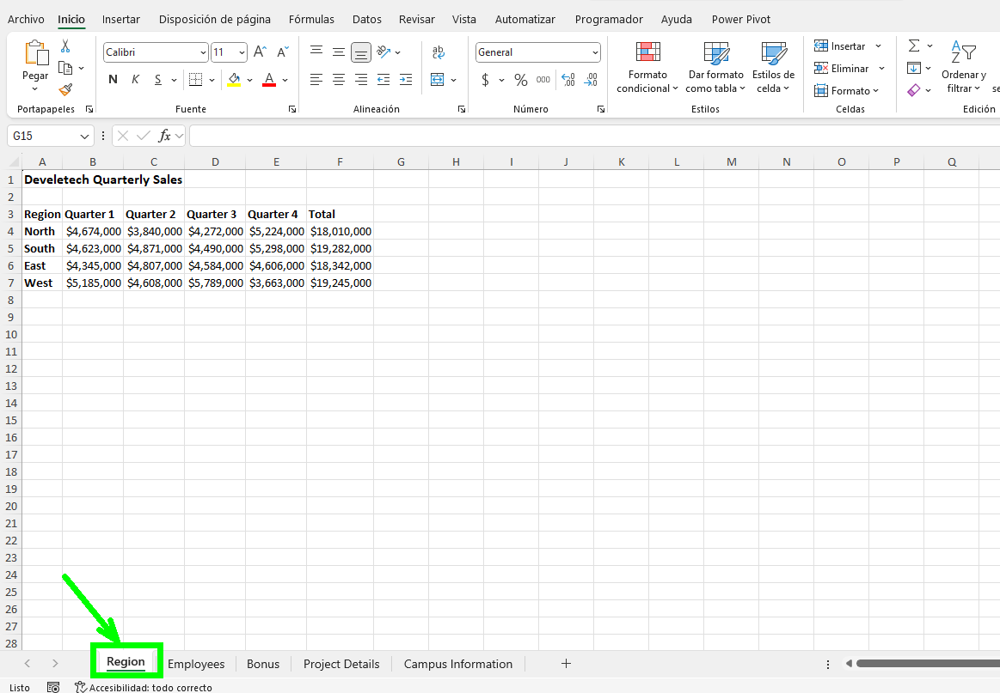

### Tarea 2. Usa el cuadro de diálogo _Nuevo Nombre_ para crear un rango con nombre en la columna Quarter1.
Paso 1. Selecciona la celda B4 y presiona _Ctrl+Shift+Flecha Abajo_ para seleccionar todo el rango en la columna B.
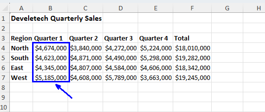

Paso 2.  Selecciona __Fórmulas → Asignar Nombre_.

Paso 3. En el cuadro de diálogo en el campo __Nombre_, verifica que aparezca *Quarter_1*.

Paso 4. En el menú desplegable _Ámbito_, asegúrate de que esté seleccionada la opción *Libro*.

Paso 5. Asegúrate de que el campo _Se refiere a_ muestre la siguiente referencia de rango: *=Region!$B$4:$B$7* y selecciona Aceptar.

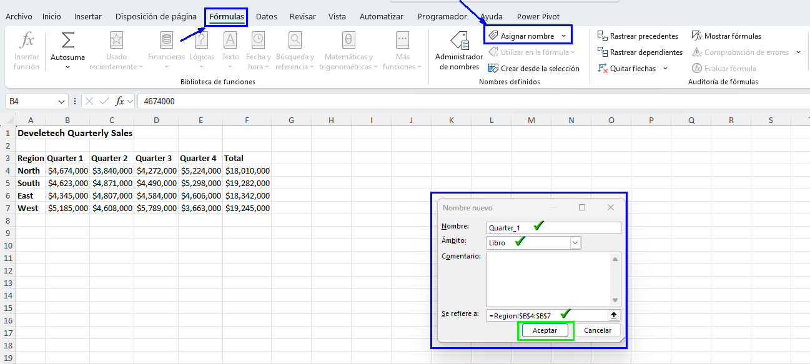

### Tarea 3.Usa el _Cuadro de Nombre_ para crear un rango con nombre en la columna Quarter 2.

Paso 1. Selecciona las celdas *C4:C7*, da clic derecho selecciona _Definir nombre_, luego escribe *Quarter_2* y presiona Enter.

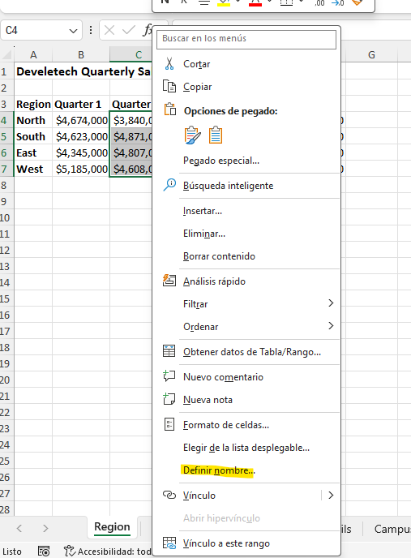

Verifica que el nuevo nombre de rango *Quarter_2* esté listado en el Cuadro de Nombre.
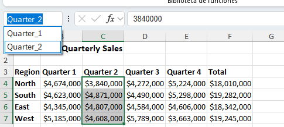

### Tarea 4.Usa el comando _Crear desde selección_ para crear un rango con nombre en las columnas Quarter 3 y Quarter 4.

Paso. 1 Selecciona el rango *D3:E7*
y selecciona _Fórmulas → Crear desde selección_.

Paso 2. Asegúrate de que la casilla Fila superior esté marcada y selecciona Aceptar.

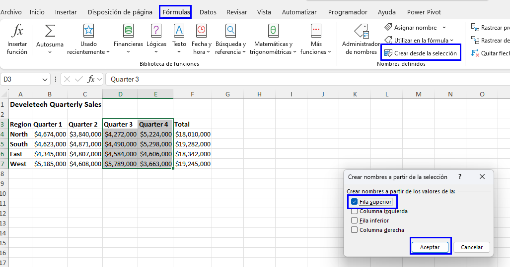
Paso 3. Selecciona la flecha desplegable del Cuadro de Nombre y verifica que los dos rangos con nombre adicionales existan, confirmando que los nombres aparezcan como se esperaba.

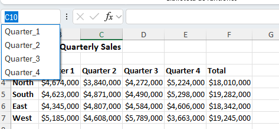

### Tarea 5.Usa el comando Crear desde selección para crear rangos con nombre para las filas de la Región simultáneamente.

Paso 1. Selecciona el rango *A4:E7*

Paso 2. Selecciona Fórmulas _→ Crear desde selección_. Asegúrate de que la casilla de verificación _Columna izquierda_ esté marcada y selecciona Aceptar.

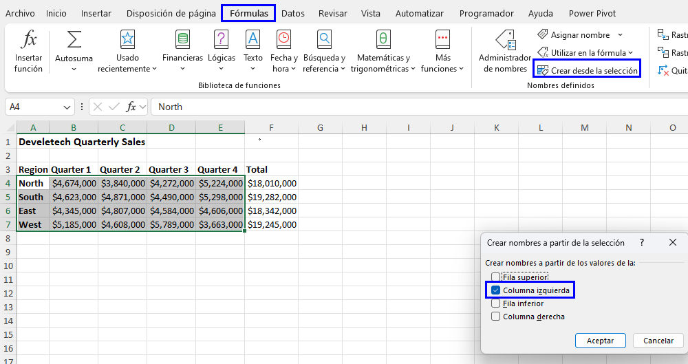

Verifica que Excel haya creado cuatro rangos con nombre únicos para las filas de Región.
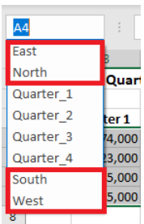

### Tarea 6.Navega a un rango y verifica el total correcto.

Paso 1.Desde la lista desplegable del Cuadro de Nombre, selecciona __South_.
Verifica que Excel haya seleccionado los valores trimestrales para el rango South en B5.

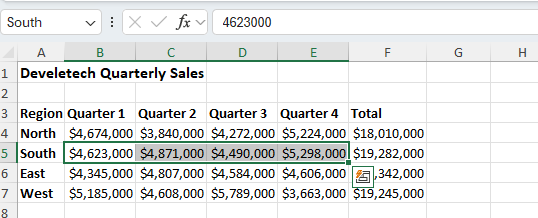

Paso 2. Con este rango seleccionado, observa el Total para el rango en la celda *F5* y verifica que el mismo total aparezca en la Barra de estado para la función _Suma_.

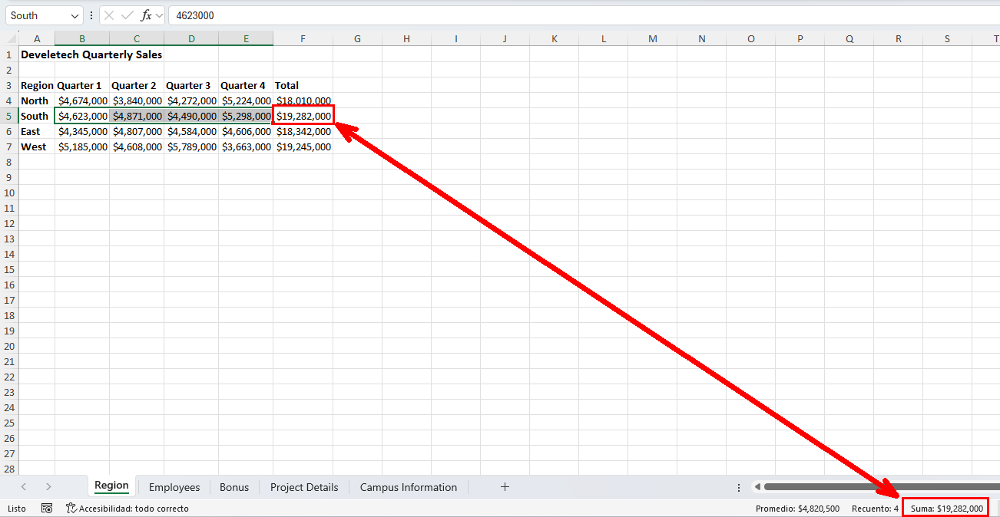

### Tarea 7. Edita los nombres de los rangos para las columnas trimestrales para hacerlos un poco más cortos.

Paso 1. Selecciona __Fórmulas → Administrador de nombres_.

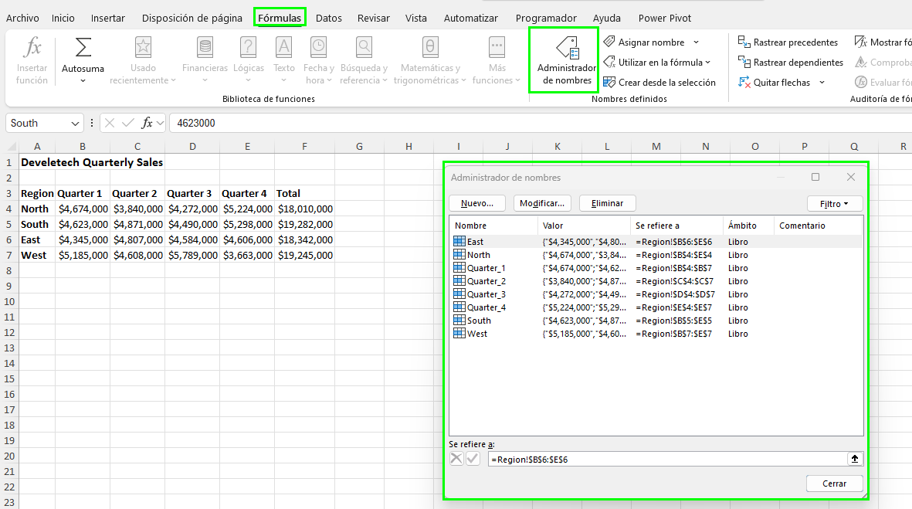

Paso 2. Selecciona el rango con nombre Quarter_1 y selecciona Modificar.
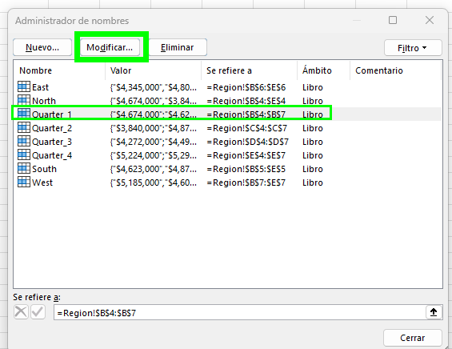

Paso 3. En el campo Nombre, escribe *Qtr_1* y selecciona Aceptar.
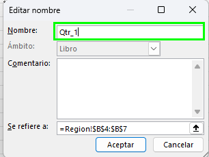

Paso 4. Cambia el rango con nombre Quarter_2 a Qtr_2, Quarter_3 a Qtr_3  y Quarter_4 a Qtr_4, respectivamente.

Paso 5. Cierra el administrador de nombres y examina que se hayan guardado los cambios realizados.

Paso 6. Guarda los cambios realizados en el libro.
### Resultado esperado
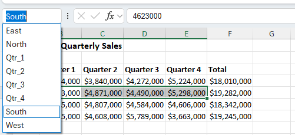
> [!NOTE]
> Aunque ciertamente es útil poder nombrar un rango o una celda para facilitar la navegación, el verdadero poder de esta función radica en su capacidad para identificar fácilmente referencias en las fórmulas y para insertar rápidamente y con precisión esas referencias en múltiples fórmulas. Una vez que has definido un nombre, puedes simplemente usar ese nombre en lugar de una referencia estándar de celda o rango en cualquier fórmula o función.

# Parte 2. Usar Nombres Definidos en una Fórmula

## Objetivo de la práctica:
Al finalizar la práctica, serás capaz de:

- Aprender a utilizar nombres de rango y funciones de autocompletado en Excel para optimizar la creación de fórmulas, mejorar la precisión en el manejo de datos y reemplazar referencias de celdas con nombres definidos para facilitar la gestión y revisión de las hojas de cálculo.

## Duración aproximada:
- 5 minutos.

## Instrucciones 

Antes de Comenzar

El libro de trabajo *My Current Projects.xlsx* está abierto.

### Escenario:
Ahora que has creado rangos con nombre para las diversas columnas, los utilizarás para introducir funciones que proporcionen a tu supervisor las ventas totales por representante para el primer trimestre. Esto facilita que cualquier persona que revise tu trabajo identifique de dónde provienen los valores en la hoja de cálculo.

### Tarea 1.Usa un rango existente en una función.

Paso 1. Verifica que estás en la hoja de cálculo Region, selecciona la celda *F4* y escribe _=SUMA(_

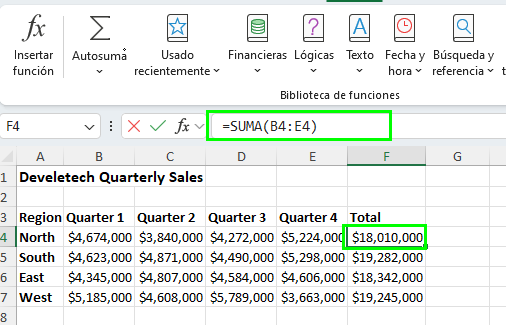
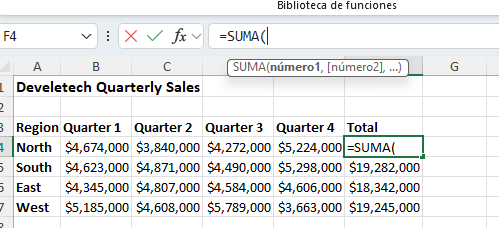
Paso 2.  Selecciona Fórmulas → _Usar en Fórmula → North_.
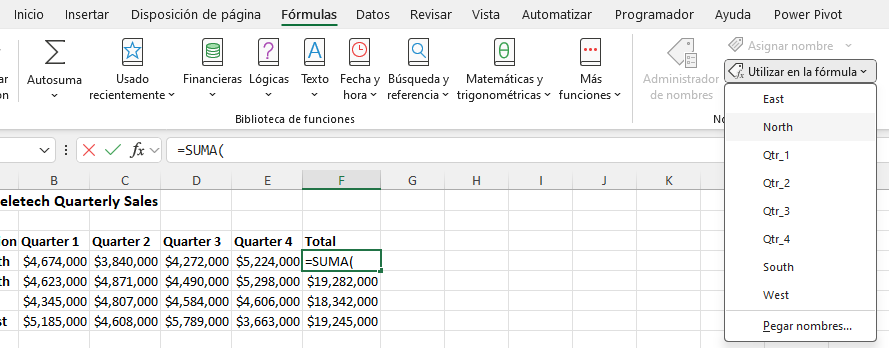
Paso 3.Escribe "_)_" y presiona Enter para completar la función.
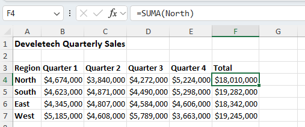

### Tarea 2.Ingresa un nombre de rango utilizando el método de Autocompletar Fórmulas.

Paso 1. Selecciona la celda F5, si es necesario.

Paso 2. Escribe _=SUMA(sou._

Paso 3. Desde el menú emergente de Autocompletar Fórmulas, haz doble clic en South o presiona Tab.
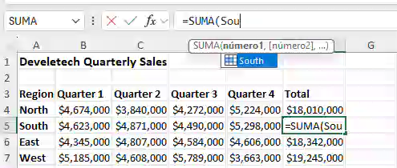

Paso 4. Escribe "_)_" y presiona Enter para completar la función.

Paso 5. Reemplaza las referencias de celdas con nombres de rangos.Usa los mismos pasos con _East_ y _West_ 

### Resultado esperado
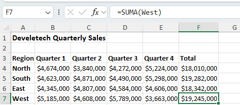
# Parte 3. Localización y Uso de Funciones Especializadas.

## Objetivo de la práctica:
Al finalizar la práctica, serás capaz de:

- Utilizar funciones de Excel para filtrar y contar datos basados en condiciones definidas, lo que es una habilidad valiosa para la gestión y análisis de información en un entorno laboral.

## Duración aproximada:
- 8 minutos.

## Instrucciones 

####  El libro de trabajo __Current Projects.xlsx_ está abierto.
### Escenario: 
Eres un Generalista de Recursos Humanos para Develetech Industries. Te han proporcionado un libro de Excel que contiene las fechas de contratación de varios empleados. Tu gerente te ha pedido que encuentres qué funciones utilizar para determinar los años de antigüedad de cada empleado. Tienes dos razones para calcular la antigüedad: los empleados con más de 20 años en la empresa recibirán un premio, y los empleados con menos de 5 años de empleo deben asistir a una capacitación de seguridad obligatoria. Necesitas encontrar una función que inserte la fecha de hoy y luego calcular el número de años que un empleado ha estado en la empresa en base a esa fecha, y contar el número de empleados que cumplen con los criterios de antigüedad.

### Tarea 1. Determinar qué función insertará la fecha actual.

Paso 1. Selecciona la hoja de cálculo _Employees_ y verifica que la celda *B3* esté seleccionada.

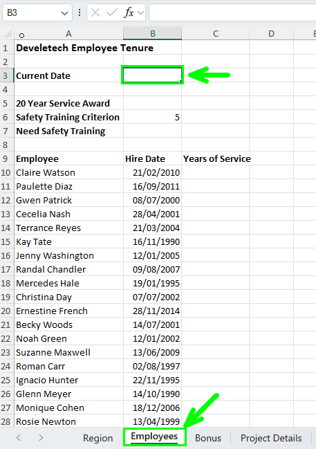

Paso 2.  En la cinta de opciones, selecciona el campo de Búsqueda y escribe: _insertar fecha actual._

Paso 3. Selecciona Obtener ayuda sobre "insertar fecha actual".
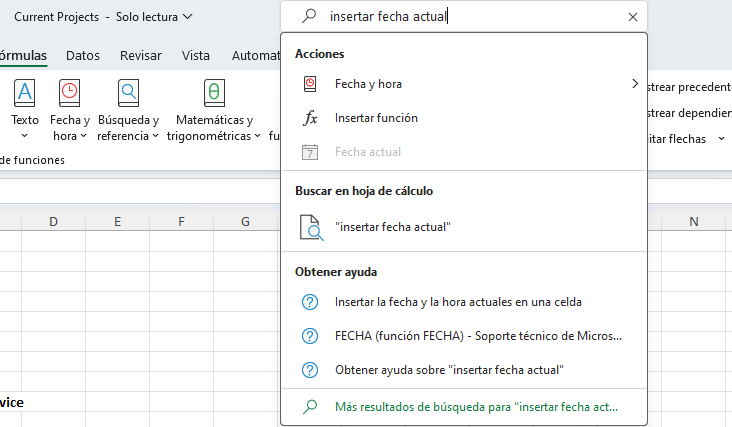

Paso 4. Selecciona el tema de ayuda Insertar la fecha y hora actuales en una celda.

Paso 5. Lee el tema de ayuda sobre cómo insertar la fecha actual y cierra el panel de tareas de Ayuda.

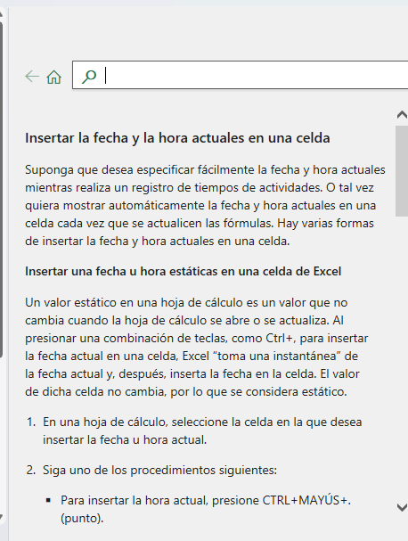

Paso 6. En la celda B3, escribe _=HOY()_ y presiona Enter.

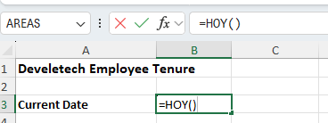

### Tarea 2. Calcular el valor de los años de servicio para cada empleado.

Paso 1. Selecciona la celda C10.

Paso 2. Introduce la fórmula _=($B$3-B10)/365_ y presiona Enter.

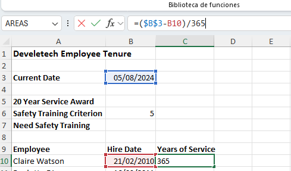

Paso 3. Selecciona la celda 
*C10* y haz doble clic en el controlador de relleno automático para completar los años de servicio restantes hasta la celda *C39.*

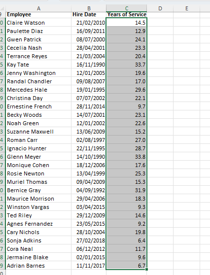

### Tarea 3. Determinar el número de empleados con más de 20 años de servicio.

Paso 1. Selecciona la celda B5.

Paso 2.  Selecciona _Fórmulas → Insertar función._

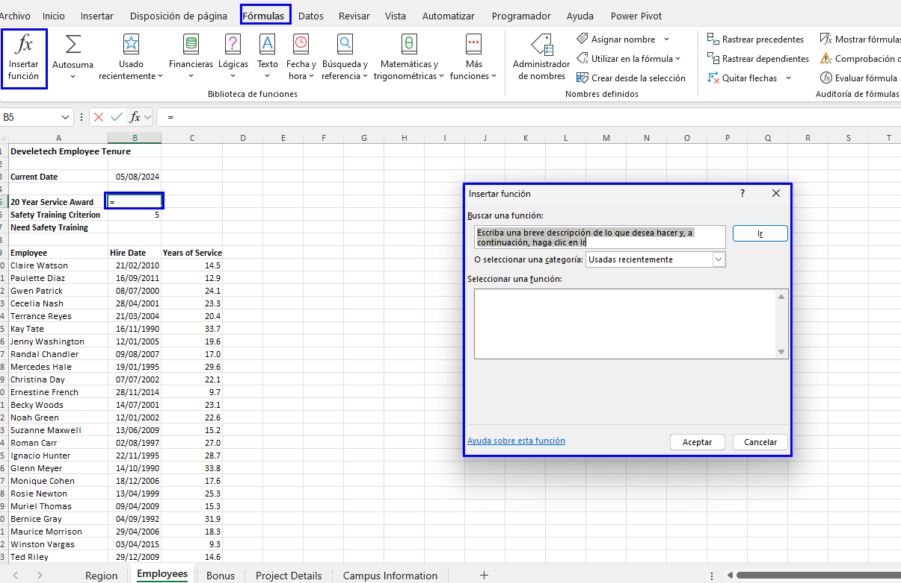

Paso 3. Selecciona la flecha desplegable de O seleccionar una categoría y elige Estadísticas.
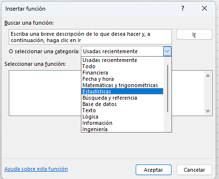

Paso 4. En el cuadro de lista Seleccionar una función, selecciona _CONTAR.SI_ y haz clic en Aceptar.
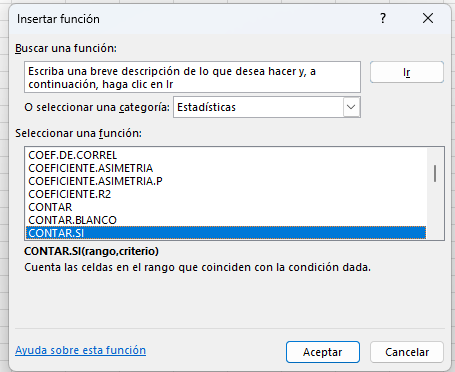

Paso 5. En el cuadro de diálogo Argumentos de función, verifica que el cursor esté en el cuadro de texto Rango. Selecciona el rango *C10:C39*
y luego presiona __Tab._

Paso 6. El criterio sera >=20 y selecciona Aceptar
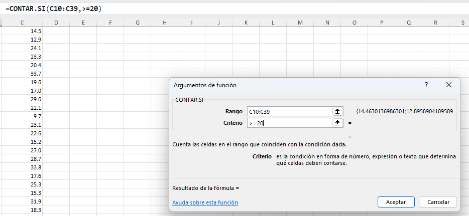

[!Note] 
Debido a que la fecha actual cambia, puede haber más de diez empleados con una antigüedad superior a 20 años en la fecha en que estés completando la actividad del curso.

### Tarea 4. Determina el número de empleados que necesitan asistir a la capacitación de seguridad.

Paso 1. Selecciona la celda *B7.*

Paso 2. En la barra de fórmulas, selecciona __Insertar función._

Paso 3. Selecciona la flecha desplegable de O selecciona una categoría y selecciona Más recientes.

Paso 4.  En el cuadro de lista Selecciona una función, selecciona __CONTAR.SI_ y selecciona Aceptar.

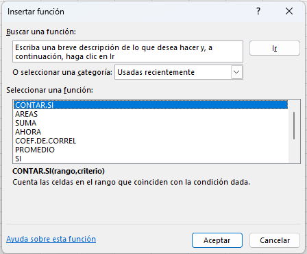

Paso 5. En el cuadro de texto Rango, selecciona el rango *C10:C39*
y presiona Tab.

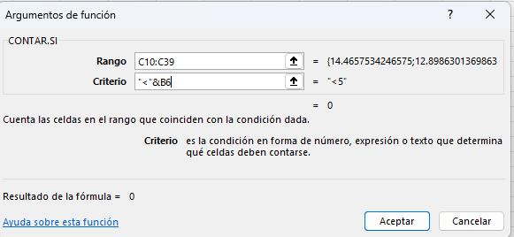

[!IMPORTANT] En el cuadro de texto Criterio, escribe "<"&B6 y selecciona Aceptar.
El carácter de ampersand (&) que se usa aquí combina el operador menor que (<) encerrado entre comillas y el valor de la celda B6 para el criterio "<5".

Paso 6. Guarda los cambios realizados en el libro. 

### Resultado esperado
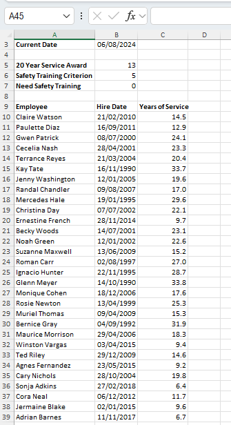

# Parte 4. Trabajando con Funciones Lógicas

## Objetivo de la práctica:
Al finalizar la práctica, serás capaz de:

- Estructurar fórmulas que integren múltiples niveles de lógica, optimizando así la eficiencia y precisión en el análisis de datos.

## Duración aproximada:
- 8 minutos.

## Instrucciones 

## Escenario
Encabezando el equipo de ventas en Devletech, has recomendado una estructura de compensación tal que se otorgue un bono del 1 por ciento sobre las ventas totales a todos los vendedores que superen sus metas de ventas. Además, para cada categoría con ventas superiores a $85,000, se les otorgará un bono del 1 por ciento de las ventas de esa categoría. También deseas contar el número de veces que un empleado alcanza la meta de la categoría. Usarás funciones lógicas para calcular rápida y fácilmente estos bonos.

### Tarea 1. Descripción de la tarea a realizar.
Paso 1.Selecciona la hoja de cálculo Bonus.

Paso 2. Verifica que la celda J8 esté seleccionada 
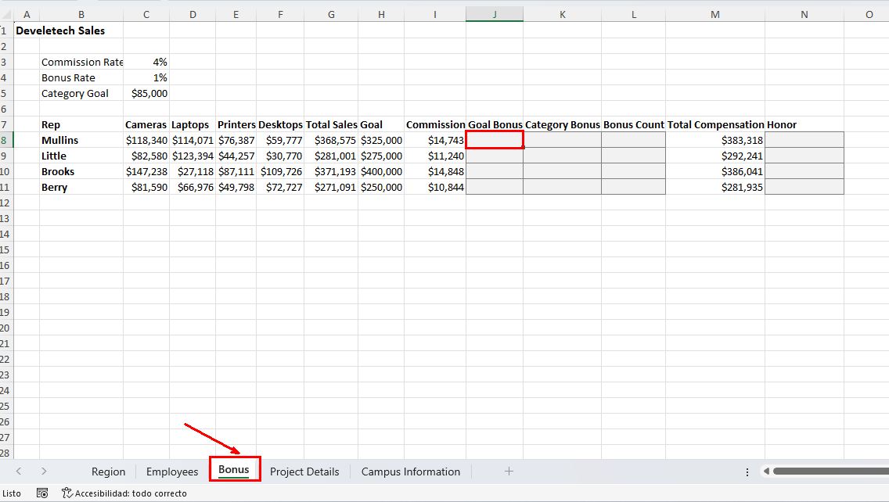

Paso 3. En la barra de fórmulas, selecciona Insertar Función.Categoría _Lógica_ , selecciona _SI_

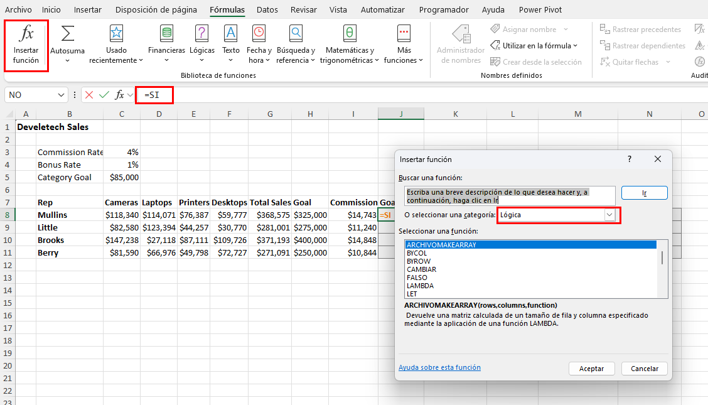

Paso 4. En el cuadro de texto Prueba_lógica, escribe G8>H8 y presiona Tab.

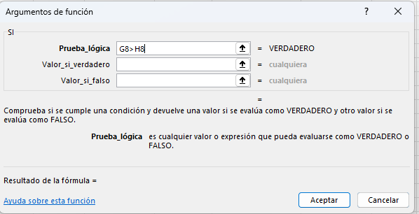

Paso 5. En el cuadro de texto _Valor_si_verdadero_, escribe G8*$C$4 y presiona Tab.

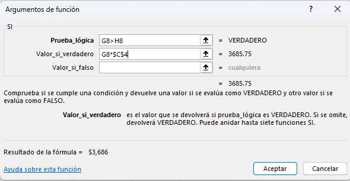

Paso 6. En el cuadro de texto _Valor_si_falso_, escribe 0 y selecciona Aceptar.
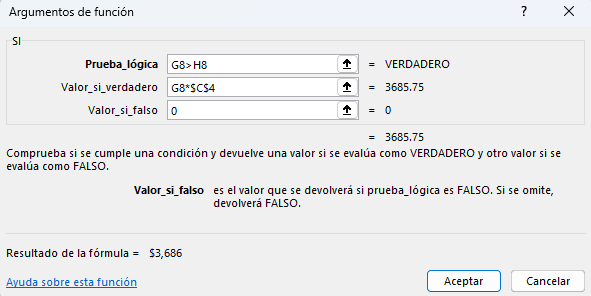

Paso 7. AutoCompleta la fórmula en las celdas a partir de *J9*, para calcular el bono de objetivo para los demás empleados.
Verifica que un bono de objetivo ha sido ganado por todos menos un empleado.

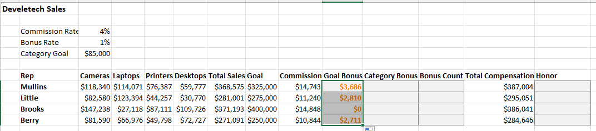

### Tarea 2. Ingresa una fórmula para calcular el bono de categoría, el 1 por ciento de las ventas para cada categoría superior a $85,000, para los empleados.

Paso 1. Selecciona la celda *K8* y escribe _=$C$4*SUMAR.SI(_

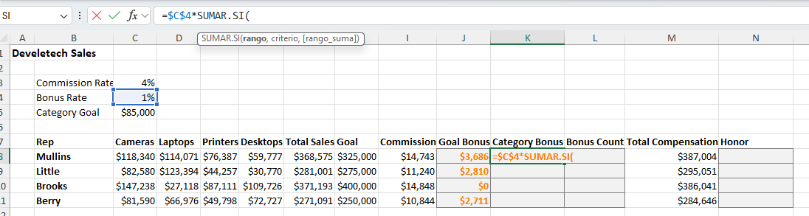

Paso 2.  En la barra de fórmulas, selecciona Insertar Función.

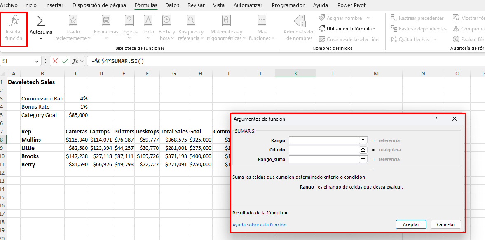

Paso 3. En el cuadro de diálogo Argumentos de Función, en el cuadro de texto _Rango_, escribe *C8:F8* y presiona Tab.

Paso 4. En el cuadro de texto _Criterio_, escribe >85000 y selecciona Aceptar.

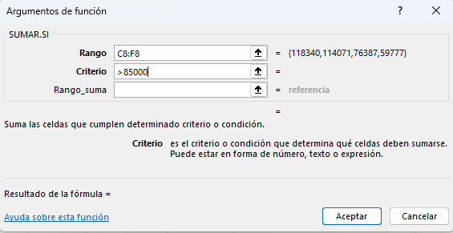

Paso 5. AutoCompleta la fórmula en las celdas *K9:K11* para calcular el bono de categoría para los empleados restantes. Verifica que todos los empleados, excepto uno, recibieron un bono de categoría.

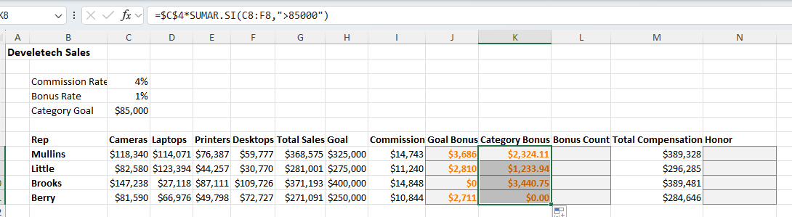

### Tarea 3. Ingresa una función para calcular el número de veces que cada empleado recibió un bono de categoría.

Paso 1. En la celda *L8*, escribe _=CONTAR.SI(C8:F8,">"&$C$5)_ y presiona Enter.

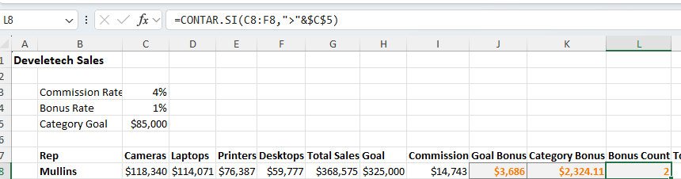

Paso 2. AutoCompleta la fórmula en las celdas *L9:L11* para calcular el número de bonos de categoría para los empleados restantes.
Verifica los conteos de cada bono de categoría.

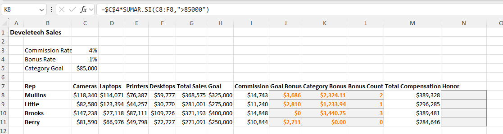

## Continuación
### Escenario
Estás satisfecho con el progreso de tu hoja de cálculo de bonificaciones. Ahora que has calculado los bonos por objetivo y por categoría, así como contado el número de bonos por categoría, deseas probar para ver qué empleados serán premiados con unas vacaciones en el "Círculo de Ganadores". Si los empleados superan sus objetivos y obtienen un bono en dos o más categorías de negocio, serán premiados con unas vacaciones en el "Círculo de Ganadores".
Paso 3. Guarda el libro de trabajo y mantén el archivo abierto.

### Tarea 1. Comienza una fórmula anidada para probar si los empleados reciben las vacaciones del "Círculo de Ganadores"

Paso 1. Verifica que la hoja de cálculo Bonus esté seleccionada y selecciona la celda *N8.*

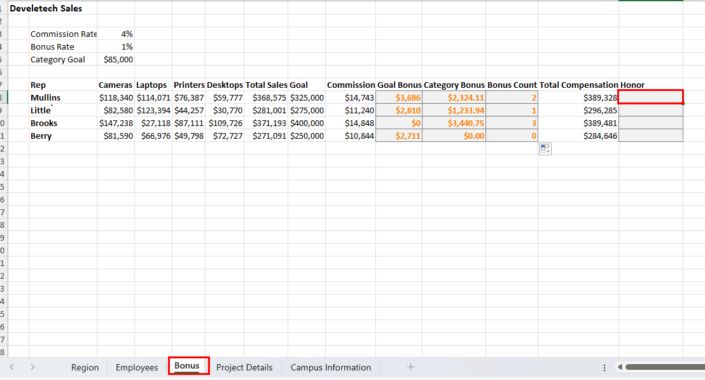

Paso 2.Escribe =SI(Y( y luego, en la barra de fórmulas, selecciona Insertar Función.
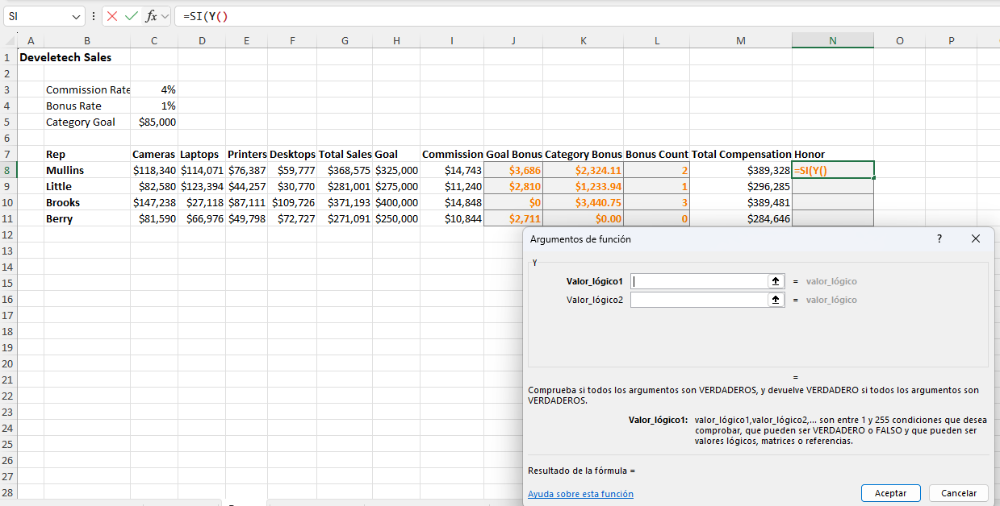

Paso 3. En el cuadro de diálogo Argumentos de Función, en la función _Y_, verifica que tu cursor esté en el cuadro de _Valor_Lógico1._

Paso 4. Escribe *J8>0* y presiona Tab.

Paso 5. En el cuadro de _Valor_Lógico2_, escribe *L8>1.* y da clic en aceptar.

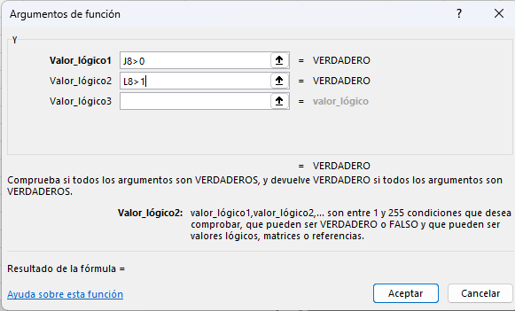

Paso 6. Agrega los argumentos para la parte de la función SI en la función anidada. En la barra de fórmulas, selecciona la función SI.

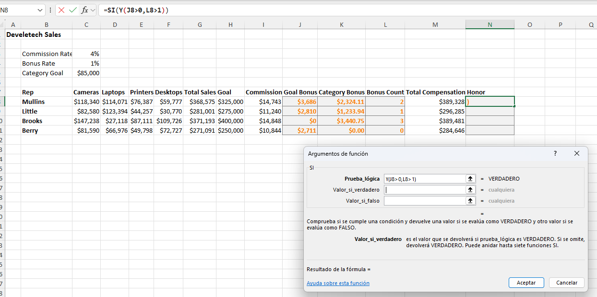

Paso 7. En el argumento de la función _Valor_si_verdadero_ escribe "Circulo de ganadores"

Paso 8. En el cuadro de texto _Valor_si_falso_, escribe "" y selecciona Aceptar.

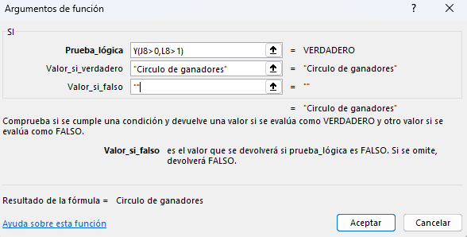

### Resultado esperado
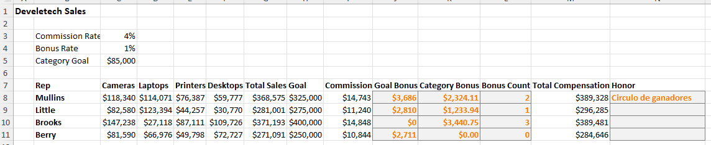

# Parte 5. Trabajando con Funciones de Fecha y Hora

## Objetivo de la práctica:
Al finalizar la práctica, serás capaz de:

- Aplicar funciones de fecha y hora para gestionar y analizar cronogramas de proyectos, optimizando la planificación y el seguimiento del tiempo en entornos empresariales.

## Duración aproximada:
- 5 minutos.

## Instrucciones 

## Escenario

Basado en el excelente trabajo que realizaste al calcular las bonificaciones de los empleados, ahora se te ha pedido que calcules el número de días laborables entre el inicio y el fin de un proyecto, teniendo en cuenta varios días de cierre estacional que ocurrirán dentro de las fechas del proyecto. Para hacer esto, utilizarás la función DIAS.LAB 

### Tarea 1. Ingresa la función DIAS.LAB para calcular el total de días laborables del proyecto.

Paso 1.Selecciona la hoja de cálculo llamada _Project Details_

Paso 2.  Asegúrate de que la celda *B9* esté seleccionada.

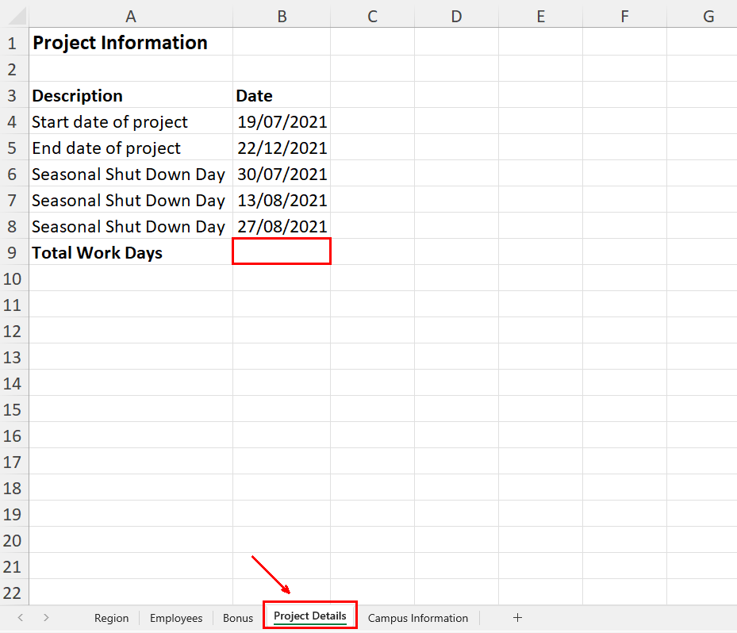

Paso 3. En la Barra de fórmulas, selecciona Insertar función.

Paso 4. En el cuadro de diálogo Insertar función, en la lista desplegable O selecciona una categoría, selecciona la categoría Fecha y hora.

Paso 5.  En el cuadro de lista Selecciona una función, selecciona la función _DIAS.LAB_  y selecciona Aceptar.

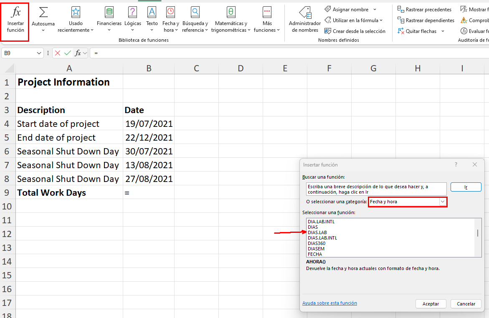

Paso 6.  En el cuadro de texto _Fecha_inicial_ , escribe o selecciona la celda *B4* y presiona Tab.

Paso 7. En el cuadro de texto _Fecha_final_, selecciona la celda *B5* y presiona Tab.

Paso 8. En el cuadro de texto _Festivos_, selecciona el rango *B6:B8*
y selecciona Aceptar.

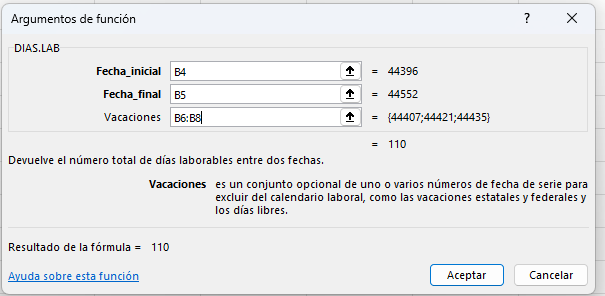

Paso 9. Guarda los cambios y manten abierto el libro.

### Resultado esperado
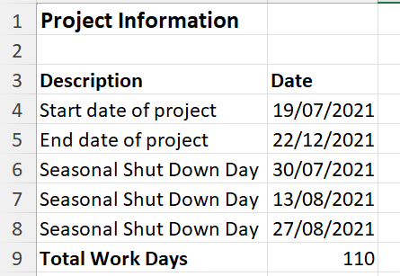

# Parte 6. Trabajando con funciones de texto 

## Objetivo de la práctica:
Al finalizar la práctica, serás capaz de:
- Utilizar las funciones IZQUIERDA, DERECHA, y EXTRAE para extraer partes específicas de texto dentro de una celda.

- Aplicar la función CONCAT para combinar datos de múltiples celdas en una sola cadena de texto.

## Duración aproximada:
- 8 minutos.

## Instrucciones 

### Escenario:

Eres un generalista de Recursos Humanos en Develetech Industries. Tu empresa tiene un gran campus con edificios de varios pisos. Para localizar a un empleado en cualquiera de los edificios del campus, se te ha pedido que extraigas varias partes de datos de un texto proporcionado por tu gerente. Los dos primeros caracteres del código representan la notación del campus, los siguientes dos caracteres representan el código del edificio, y los últimos cuatro caracteres representan la ubicación en el piso. Para hacer esto, utilizarás funciones de texto.

### Tarea 1. Selecciona la hoja de cálculo Campus Information

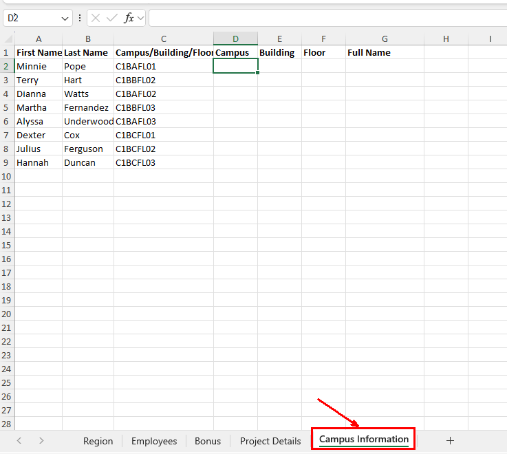

### Tarea 2.Extrae el código del campus, los dos primeros caracteres, del campo combinado.

Paso 1. Asegúrate de que la celda D2 esté seleccionada.

Paso 2. Selecciona __Fórmulas > Texto > IZQUIERDA._

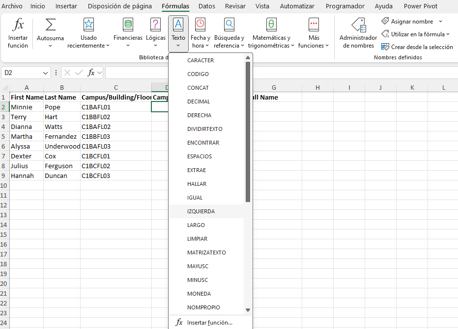

Paso 3. En el cuadro de texto Texto, escribe **C2* y presiona Tab.

Paso 4.  En el cuadro de texto Num_caracteres, escribe 2 y selecciona Aceptar.Verifica que el código del campus fue extraído.
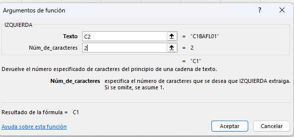

### Tarea 3. Extrae el código del edificio, el tercer y cuarto caracteres, del campo combinado.

Paso 1. Selecciona la celda E2 

Paso 2. Selecciona __Fórmulas > Texto > EXTRAE._

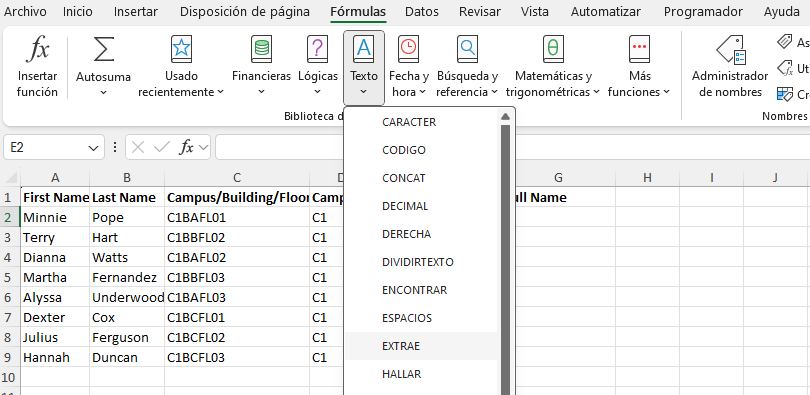

Paso 3. En el cuadro de texto __Texto_, escribe *C2* y presiona Tab.

Paso 4.  En el cuadro de texto __Posición_inicial_, escribe 3 y presiona Tab.

Paso 5. En el _Núm_de_caracteres_ escribe 2 y presiona Tab
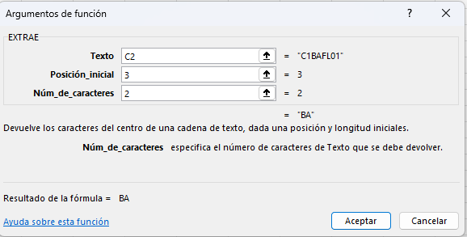

### Tarea 4. Extrae el código del piso, los últimos cuatro caracteres, del campo combinado.

Paso 1. Selecciona la celda *F2.*

Paso 2.  Selecciona _Fórmulas > Texto > DERECHA._

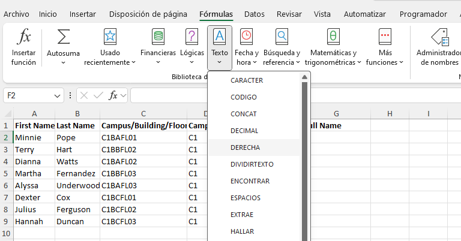

Paso 3. En el cuadro de texto Texto, escribe *C2* y presiona Tab.

Paso 4. En el cuadro de texto _Núm_caracteres_, escribe 4 y selecciona Aceptar.Verifica que el código del piso fue extraído.

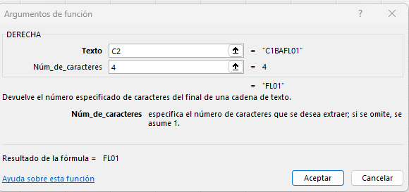
 
### Tarea 5. Concatena el nombre y el apellido en un solo campo.

Paso 1.  Selecciona la celda G2.

Paso 2. Escribe =CONCAT y presiona Tab para usar la función de autocompletar de fórmulas.

Paso 2. En el argumento [text1], selecciona o escribe A2 y escribe una coma (,).

Paso 3.  En el argumento [text2], escribe "" y escribe una coma (,).

Nota: Hay un espacio entre las dos comillas.

Paso 4. En el argumento [text3], selecciona o escribe B2 y escribe un paréntesis de cierre ) para completar la función y presiona Ctrl+Enter.

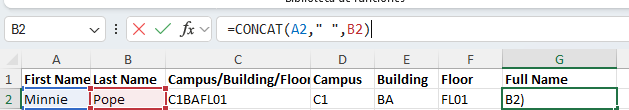

Verifica que el nombre del empleado aparezca en el formato de nombre completo.

### Tarea 6.Relleno Automático en las filas restantes de datos. 

Paso 1. Selecciones las celdas D2:G2 y haz doble clic en el controlador de Relleno automático de la celda G2.
Verifica que el campus, edificio, piso y nombres completos estén listados para todo el personal.

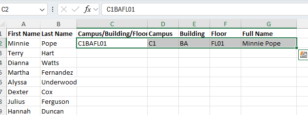

Paso 2. Guarda los cambios y cierra el libro.
### Resultado esperado

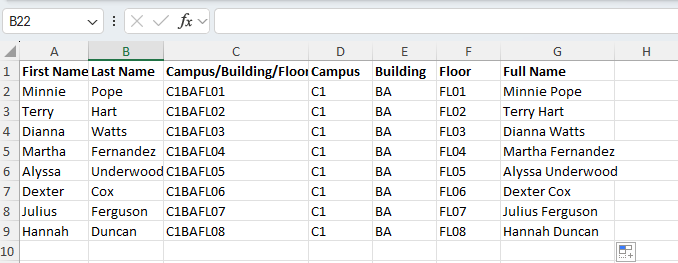