# Parte 1. Ordenando Datos.

## Objetivo de la práctica:
Al finalizar la práctica, serás capaz de:
- Aprender a utilizar las funciones de ordenamiento en Excel para organizar datos de manera efectiva en múltiples niveles, permitiendo una mejor visualización y análisis de la información. 
- Al finalizar esta práctica, serás capaz de ordenar listas de empleados por diferentes criterios, como apellido, departamento y extensión, utilizando tanto opciones de ordenación simples como personalizadas.

## Duración aproximada:
- 8 minutos.

## Instrucciones: 

### Escenario: 
Eres un generalista de recursos humanos en Develtech Industries y tu gerente te ha pedido que organices la lista de empleados. Quieres buscar rápidamente a los empleados de varias maneras ordenando los datos. La lista de empleados contiene datos que te permitirán ordenar por nombre, fecha, departamento y ubicación de la oficina.

### Tarea 1. Ordenar la lista de empleados por Apellido.

Paso 1. Abre el archivo :
[Develetech Lists](<Develetech Lists.xlsx>)
y verifica que la hora de trabajo Employees esté seleccionada. 

Paso 2. Verifica que la celda A1 esté seleccionada y selecciona _Datos -> Ordenar de A a Z_. Confirma que la lista de empleados esté ordenada por Apellido.

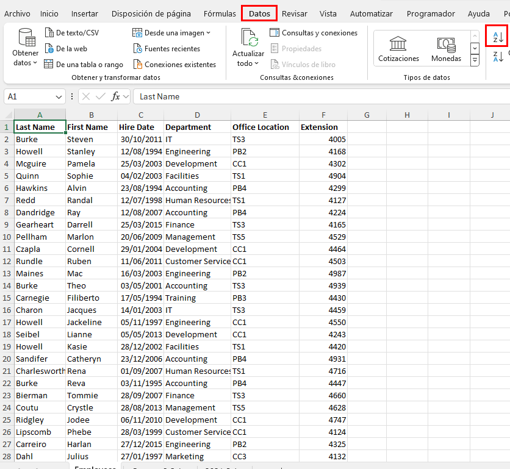

### Tarea 2. Ordenar la lista de empleados por Departamento.

Paso 1. Selecciona la celda D1 y selecciona Datos -> Ordenar.
Observa que Excel mantuvo la ordenación previa por Apellido.

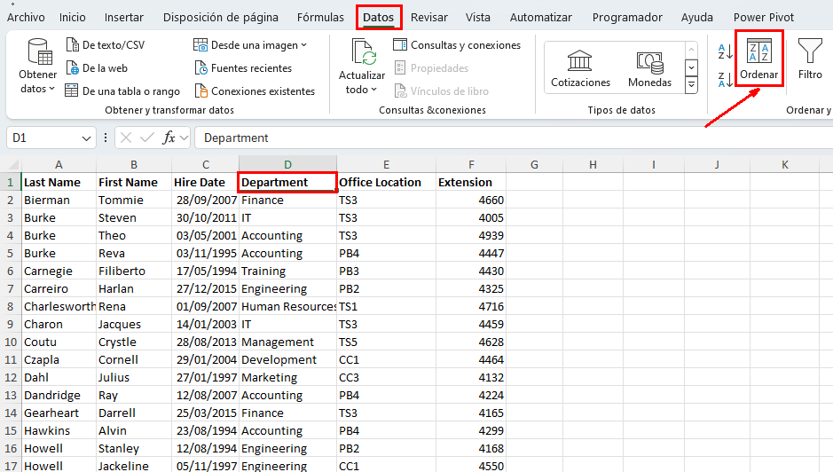

Paso 2. Selecciona la flecha desplegable de Ordenar por y selecciona _Departament_.

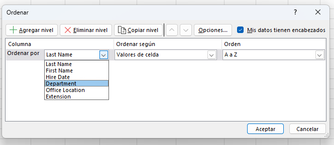

Paso 3. Selecciona Aceptar para ver la lista de empleados.
Verifica que la lista de empleados esté ordenada por Departamento.

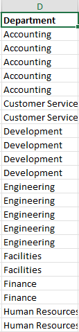

 
 ### Tarea 3. Ordenar la lista de empleados por Apellido, luego por Departamento y luego por Extensión.

 Paso 1. Selecciona __Datos -> Ordenar_.

 Paso 2. Selecciona la flecha desplegable de _Ordenar por_ y selecciona _Apellido_.

Paso 3. Selecciona _Agregar Nivel_.

Paso 4. Selecciona la flecha desplegable de _Luego por_ y selecciona __Departamento_.

Paso 5. Selecciona _Agregar Nivel_ de nuevo.

Paso 6. Selecciona la última flecha desplegable de _Luego por_ y selecciona _Extensión_.

Paso 7. Selecciona Aceptar para ordenar la lista de empleados por Apellido, luego por Departamento, y luego por Extensión.
Confirma que la lista de empleados ha sido ordenada por Apellido, luego por Departamento, y luego por Extensión.

Paso 8. Salva los cambios realizados en el libro y manten abierto el archivo.

### Resultado esperado:
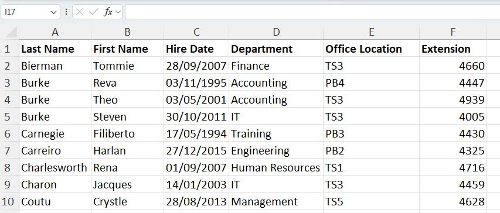

# Parte 2. Filtrando Datos.

## Objetivo de la práctica:
Al finalizar la práctica, serás capaz de:
- Aplicar filtros complejos, como seleccionar datos que pertenezcan a más de un grupo o categoría, utilizando operadores lógicos como "O" para combinar criterios en diferentes filas de la tabla de datos.
## Duración aproximada:
- 8 minutos.

## Instrucciones: 

### Antes de comenzar:

El archivo My Develtech Lists.xlsx está abierto.

### Escenario: 
Como generalista de recursos humanos en Develtech Industries, se te pidió que ordenaras la lista de empleados. Ahora se te pide que determines qué empleados están en oficinas y departamentos específicos. Para encontrar esta información, filtrarás la lista de empleados.

 ### Tarea 1. Filtra los datos para todos los empleados en la Ubicación de Oficina PB4.

Paso 1. Selecciona la celda *A1* y selecciona __Datos → Filtro_.

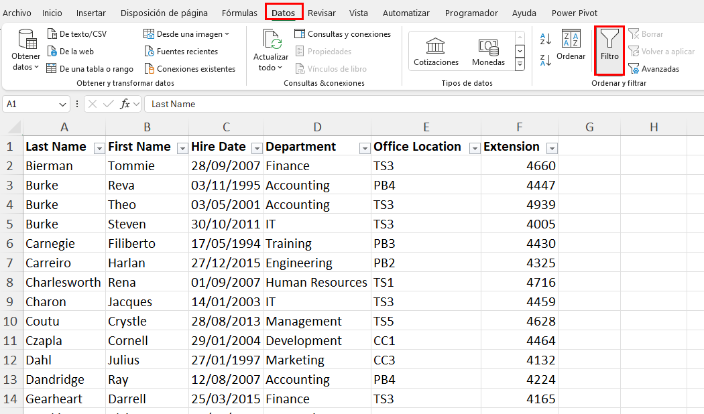

Paso 2. Selecciona la flecha desplegable del __AutoFiltro_ de Ubicación de Oficina y desmarca Seleccionar todo.

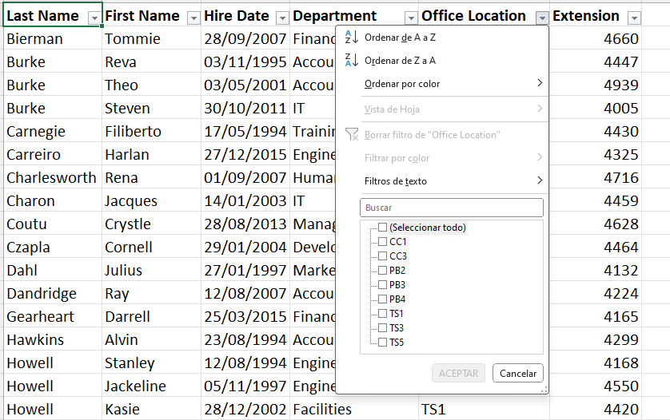

Paso 3. Selecciona PB4 y luego selecciona Aceptar.

Verifica que solo se muestre la ubicación de oficina PB4.

### Tarea 2. Filtrar empleados de los departamentos de Management (Gestión) y Marketing.

Paso 1. Selecciona la flecha desplegable del AutoFiltro de Ubicación de Oficina y selecciona Borrar Filtro de "Ubicación de Oficina".

Paso 2.  Selecciona la flecha desplegable del AutoFiltro de Departamento y desmarca Seleccionar todo.

Paso 3. Selecciona Management y Marketing y luego selecciona Aceptar.

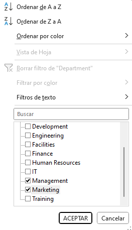

Verifica que solo se muestren los departamentos de Management (Gestión) y Marketing.

### Tarea 3. Crea un filtro personalizado para empleados que estén en los departamentos de Ingeniería o Instalaciones.

 Paso 1. Selecciona la flecha desplegable del AutoFiltro de Departamento y selecciona Borrar Filtro de "Departamento".

Paso 2. Selecciona nuevamente la flecha desplegable del AutoFiltro de Departamento y selecciona Filtros de Texto → Filtro Personalizado.

Paso 3.  Selecciona la flecha desplegable de Campos de Parámetro en la primera fila y selecciona Ingeniería.

Paso 4. Selecciona el botón de opción O.

Paso 5. Selecciona la flecha desplegable de Selección de Filtro en la segunda fila y selecciona igual.

Paso 6. Selecciona la flecha desplegable de Campos de Parámetro en la segunda fila y selecciona Instalaciones.

Paso 7. Selecciona Aceptar para filtrar la lista de empleados.
Verifica que la lista de empleados se haya filtrado para los departamentos de Ingeniería e Instalaciones.

Paso 8. Guarda los cambios en el libro y mantenlo abierto. 
### Resultado esperado:

# Parte 3. Usando funciones de Bases de Datos. 

## Objetivo de la práctica:
Al finalizar la práctica, serás capaz de:
- Aplicar funciones de base de datos en Excel para calcular sumas y promedios en conjuntos de datos específicos según criterios predefinidos.

- Modificar y ajustar criterios de búsqueda para analizar datos específicos, como ventas totales y promedio para un período determinado.

- Desarrollar habilidades en la manipulación de rangos con nombre y en la utilización de funciones avanzadas para análisis de datos en hojas de cálculo.

## Duración aproximada:
- 8 minutos.

## Instrucciones: 

### Antes de comenzar: 
Asegurate de tener el archivo __My Devletech  List_ abierto.

### Escenario: 

Como gerente de ventas en Devletech Industries, deseas analizar las cifras de ventas del segundo trimestre para identificar el impacto de las ventas en varias regiones del país. Quieres saber las ventas totales y las ventas promedio en el trimestre donde las ventas en el noreste y sureste fueron menores a $10,000. Además, calcular las ventas totales y promedio del mes de mayo te ayudará en tu análisis de ventas a nivel nacional. Decides utilizar funciones de base de datos para calcular los totales y promedios utilizando el nombre de rango Q2Sales para simplificar la fórmula.

### Tarea 1. Calcula las ventas totales y promedio en el noreste y sureste donde las ventas fueron menores a $10,000.

Paso 1. Selecciona la hoja de cálculo Quarter 2 Sales.

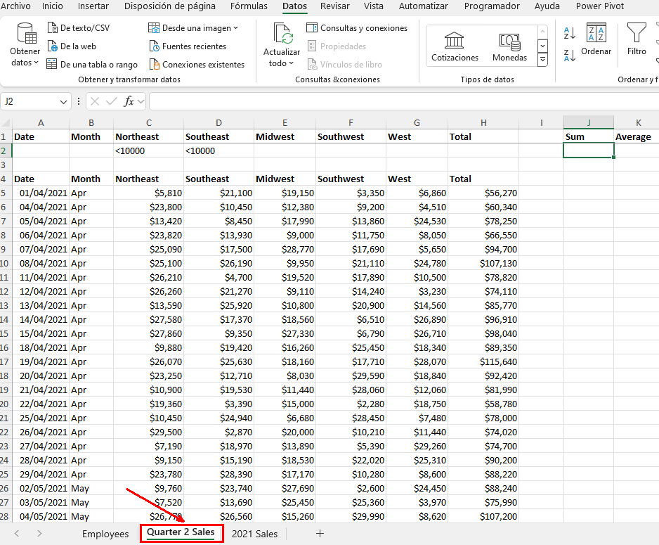

Paso 2. Verifica que la celda J2 esté seleccionada y escribe _=BDSUMA(_.

Paso 3. Desde la barra de fórmulas, selecciona Insertar Función.

Paso 4.  En el cuadro de diálogo de Argumentos de Función, en el cuadro de texto __Base de Datos_, selecciona __Fórmulas -> Utilizar en la Fórmula -> Q2Sales_.

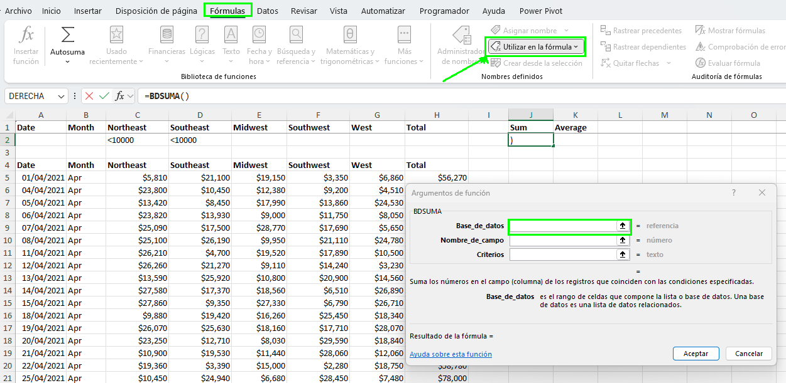

Paso 5. Presiona Tab y en el cuadro de _Nombre_de_Campo_ escribe *H4* y presiona Tab.

Paso 6. En _criterios_ selecciona *A1:H2* selecciona OK.

Verifica que las ventas totales para las regiones del Noreste y Sureste, donde las ventas fueron menores a *$10,000*, sean *$257,470*".

Paso 7. Selecciona la celda **K2* y escribe _=BDPROEMDIO(Q2Sales,H4,A1:H2)_.
Verifica que el promedio de las ventas totales para las regiones del Noreste y Sureste, donde las ventas fueron menores a $10,000, sea $64,368.

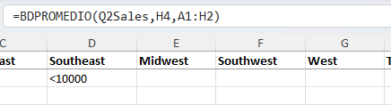

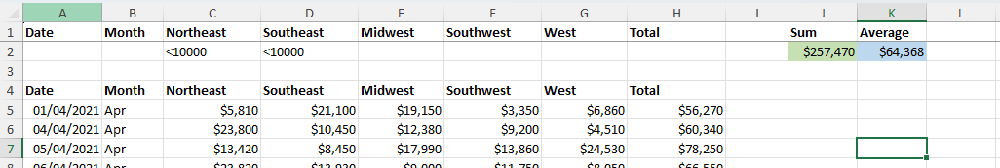

### Tarea 2. Edita los criterios para calcular las ventas totales y promedio de mayo.

Paso 1. Selecciona las celdas *C2:D2*
y presiona Eliminar.

Paso 2. Selecciona la celda B2 y escribe May.

Paso 3. Si es necesario, ajusta el ancho de la columna J y verifica las ventas totales y promedio de mayo.

Paso 4. Guarda el libro de trabajo y mantén el archivo abierto.

### Resultado esperado:

# Parte 4. Usando subtotales para sumar datos.

## Objetivo de la práctica:
Al finalizar la práctica, serás capaz de:
- Utilizar la función de Subtotales en Excel para agrupar datos y calcular sumas parciales automáticamente, facilitando el análisis de grandes volúmenes de información.

- Podrás organizar, ordenar y ajustar la presentación de datos en Excel para asegurar que la información clave se muestre de manera clara y accesible.

- Serás capaz de manipular y personalizar esquemas en hojas de cálculo para controlar la visualización de datos detallados y resúmenes, mejorando la eficiencia en la presentación de informes.

## Duración aproximada:
- 8 minutos.

## Instrucciones: 

### Antes de comenzar: 
Asegúrate de tener el archivo __My Devletech  List_ abierto.

### Escenario: 

Como analista de datos para Devletech Industries, es tu responsabilidad analizar los datos de ventas de 2021. Se te ha pedido que proporciones subtotales para las ventas totales de cada región. Decides utilizar la función de Subtotales para agrupar cada región y sumar las ventas totales.

### Tarea 1. Usa la función de Subtotales para sumar las ventas totales de cada región.

Paso 1. Selecciona la hoja de cálculo  _2021 Sales_.

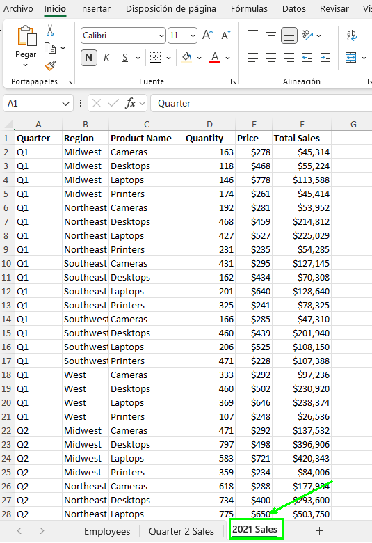

Paso 2. Selecciona la celda B1 y elige _Datos → Ordenar de A a Z_.

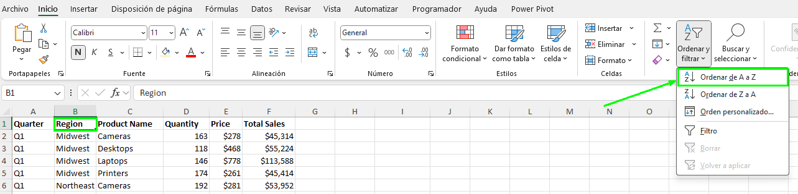

Paso 3. Selecciona _Datos → Subtotales_.

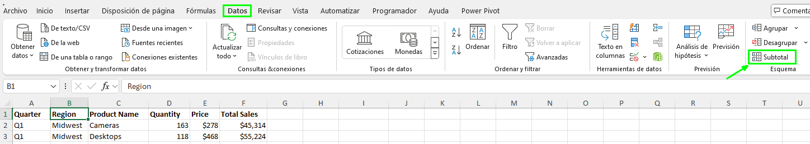

Paso 4. En el menú desplegable _Subototales_, en el apartado _Para cada cambio en_ selecciona *Region*.

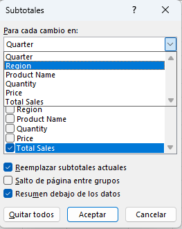

Paso 5. En el campo _Usar función_, verifica que Suma esté seleccionado.

Paso 6. En el campo _Agregar subtotal_. verifica que _Ventas Totales_ esté seleccionado y haz clic en Aceptar.

### Resultado esperado:
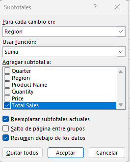

### Tarea 2. Manipula el esquema de subtotales para mostrar solo los totales regionales.

Paso 1. Junto a la fila 18, selecciona el botón de menos (−).

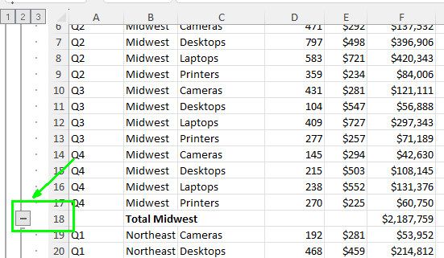

Paso 2. Selecciona el nivel de esquema 2 en el área de esquema de filas.

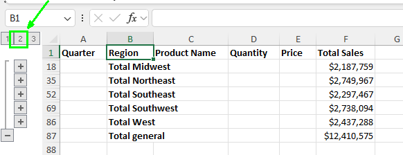

Paso 3.  Autoajusta la columna F, si es necesario, y verifica los subtotales para cada región y el total general de venta

Paso 4. Guarda los cambios realizados y cierra el archivo.

### Resultado esperado:
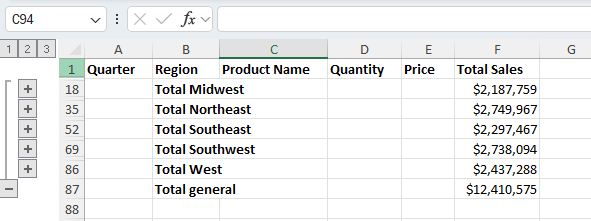
