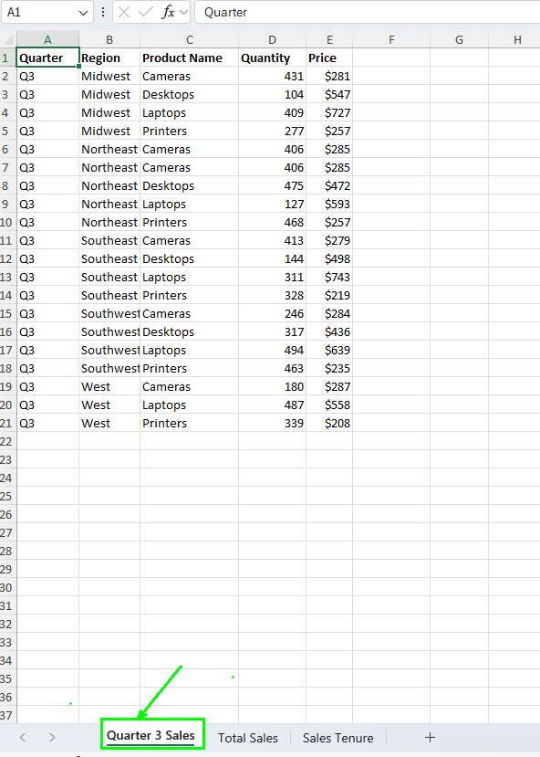

# Parte 1. Creación y modificación de tablas.

## Objetivo de la práctica:
Al finalizar la práctica, serás capaz de:
- Crear y modificar tablas en Excel de manera eficiente, aplicando estilos predefinidos, gestionando datos duplicados, y utilizando nombres definidos para facilitar la organización y análisis de conjuntos de datos. 

- Aprenderá a agregar y formatear nuevas entradas de datos en una tabla, asegurando que la presentación y la integridad de los datos se mantengan consistentes.

## Duración aproximada:
- 7 minutos.

## Instrucciones: 
### Escenario:
Como asistente administrativo del vicepresidente de ventas en Develetech Industries, se te ha pedido que diseñes un informe de las ventas del tercer trimestre. El informe de ventas del tercer trimestre debe detallar cada uno de los registros del trimestre. Decides que la mejor manera de presentar estos datos es crear una tabla a partir de los datos.
### Tarea 1. Convierte los datos de las ventas del tercer trimestre en una tabla.
Paso 1. Abre el archivo:
[Develetech Sales](<Develetech Sales.xlsx>)

Paso 2. En la hoja de cálculo Quarter 3 Sales, verifica que no haya filas o columnas en blanco dentro del conjunto de datos.

Paso 3.  Con la celda A1 seleccionada, selecciona _Insertar → Tabla_.

Paso 4.  En el cuadro de diálogo Crear Tabla, asegúrate de que el rango listado sea _=$A$1:$E$21_.

Paso 5. Verifica que la casilla Mi tabla tenga encabezados, esté marcada y selecciona Aceptar. 

Paso 6. Aplica un estilo rápido a la tabla. Si es necesario, selecciona cualquier celda dentro de la tabla para mostrar la pestaña contextual Diseño de Tabla. Selecciona la pestaña contextual Diseño de Tabla, luego en el grupo Estilos de Tabla, selecciona el botón Más.

Paso 7. En la galería Estilos de Tabla, en la sección Medio, selecciona __Oro, Estilo de Tabla Medio 12_.

### Tarea 2. Añade una nueva entrada de ventas y una nueva columna a la tabla.

Paso 1. Selecciona la celda A22 y escribe Q3, luego presiona Tab.
 Nota: Al ingresar el nuevo registro, Excel formatea automáticamente la fila según el estilo de la tabla.

Paso 2. Ingresa los valores restantes para la entrada en la fila 22:
- _B22: West_

- _C22: Desktops_
- _D22: 327_
- _E22: 668_

### Tarea 3. Elimina los datos duplicados de la región noreste (Northeast) para cámaras de la tabla.
Paso 1. Verifica que la tabla esté seleccionada y selecciona _Diseño de Tabla → Eliminar Duplicados_.

Paso 2.  En el cuadro de diálogo __Eliminar Duplicados_, verifica que la opción Mis datos tenga encabezados, esté seleccionada y que todas las columnas estén seleccionadas, luego selecciona Aceptar para eliminar la fila duplicada.

Paso 3. Verás el anuncio que un dato duplicado se ha eliminado, le das en _Aceptar_.

### Tarea 4. Crea un nombre definido para la tabla.

Paso 1. Selecciona la pestaña contextual Diseño de Tabla, si es necesario, y luego selecciona el cuadro de texto Nombre de la Tabla y escribe __Q3Sales_tbl_.

Paso 2. Presiona Enter.

### Resultado esperado:

# Parte 2. Uso de funciones de resumen en tablas.

## Objetivo de la práctica:
Al finalizar la práctica, serás capaz de:
- Calcular las ventas totales para cada fila de una tabla en Excel, habilitar la Fila de Totales y aplicar funciones de resumen para analizar los resultados de un conjunto de datos.

 - Aplicar filtros a la tabla para analizar datos específicos, como las ventas de una región particular, y guardar el archivo manteniendo la integridad de los cálculos y la estructura de la tabla.

## Duración aproximada:
- 7 minutos.

## Instrucciones: 
### Escenario:
El vicepresidente está complacido con tu trabajo en las ventas del tercer trimestre. Ahora, el vicepresidente quiere saber las ventas totales para cada fila de la tabla y para la región Suroeste, y por cada producto en la región Suroeste. Decides que la mejor manera de lograr esto es habilitar la fila de totales para la tabla y filtrar por la región Suroeste.

### Previo:
Tener abierto el archivo _Develetech Sales_.
### Tarea 1. Calcula las _Ventas Totales para cada fila de la tabla, multiplicando cantidad por precio.

Paso 1. Selecciona la celda F2 y escribe = y selecciona la celda _D2_ y Escribe _*_ y luego selecciona la celda _E2_ y presiona Enter.

Verifica que Excel haya calculado automáticamente la fórmula para las filas restantes de la tabla.

### Tarea 2. Habilita la Fila de Totales para la tabla.

Paso 1. Con cualquier celda de la tabla seleccionada, selecciona la pestaña contextual _Diseño de Tabla_ y luego selecciona la casilla de verificación _Fila de Totales_.

Paso 2. Selecciona la celda *F22* y selecciona la flecha desplegable de la _Fila de Totales._  Verifica que la función Suma esté seleccionada.

Paso 3.  Selecciona cualquier celda dentro de la tabla para cerrar el menú desplegable.Verifica que el total para el trimestre sea _$2,816,773_.

### Tarea 3. Filtra las ventas del tercer trimestre para la región Suroeste.

Paso 1. Selecciona la flecha desplegable de Filtro Automático de Región en la celda B1 y desmarca la casilla Seleccionar Todo.

Paso 2. Marca la casilla Southwest y selecciona Aceptar.
Verifica los totales del tercer trimestre para la región Suroeste.

Paso 3. Guarda el libro de trabajo y mantén el archivo abierto.

### Resultado esperado:

# Parte 3. Aplicación de Formato Condicional Intermedio. 

## Objetivo de la práctica:
Al finalizar la práctica, serás capaz de:
- Al finalizar esta práctica, serás capaz de aplicar formato condicional intermedio en Excel para identificar y resaltar automáticamente los datos de ventas que superan el promedio, utilizando reglas personalizadas para mejorar la visualización y análisis de los datos.

 
## Duración aproximada:
- 6 minutos.

## Instrucciones: 
### Previo:
Tener abierto el archivo _Develetech Sales_.
### Escenario: 

Como vicepresidente de ventas para Develetech Industries, has recopilado los datos de ventas de 2021 y los has organizado por trimestre, región y productos. Quieres averiguar qué regiones y productos están por encima del promedio. Para llevar a cabo esta tarea, decides aplicar formato condicional.

### Tarea 1. Aplica formato condicional para ver las ventas totales que están por encima del promedio.

Paso 1. Selecciona la hoja de cálculo Total Sales.

Paso 2.  Selecciona el rango *C2:C21*.

Paso 3. Selecciona _Inicio → Formato Condicional → Nueva Regla_.

Paso 4. En el cuadro de diálogo _Nueva Regla de Formato_, en la lista Seleccionar un Tipo de Regla, selecciona _Formatear solo los valores que estén por encima o por debajo del promedio_.

Paso 5. En la sección _Editar la Descripción de la Regla_, en la lista desplegable Formatear valores que estén por encima, verifica que arriba esté seleccionado.

Paso 6. Selecciona el botón _Formato_.

Paso 7. En el cuadro de diálogo Formato de Celdas, selecciona la pestaña Relleno.

Paso 8.  Selecciona el botón Efectos de Relleno.

Paso 9.  En el cuadro de diálogo _Efectos de Relleno_, en la sección Estilos de sombreado, selecciona la opción Vertical.

Paso 10. En la sección Variantes, selecciona la _variante superior derecha_ y selecciona Aceptar.

Paso 11. En el cuadro de diálogo Formato de Celdas, selecciona Aceptar.

Paso 12. Verifica que el formato condicional se haya aplicado a los datos de ventas que están por encima del promedio de $620,529.

Paso 13. Guarda los cambios en el archivo y mantenlo abierto.
### Resultado esperado:

# Parte 4. Uso de funciones lógicas para aplicar formato condicional.

## Objetivo de la práctica:
Al finalizar la práctica, serás capaz de:
- Aplicar formato condicional utilizando funciones lógicas en Excel para destacar información clave dentro de un conjunto de datos, mejorando así la capacidad de análisis y presentación visual de la información.

## Duración aproximada:
- 8 minutos.

### Antes de comenzar:
El archivo de Excel My Develtech Sales.xlsx está abierto.

## Instrucciones: 

### Escenario:
Como gerente de ventas de Develtech Industries, quieres reconocer al personal de ventas que ha estado en la empresa durante 10 años o más. Has creado una hoja de cálculo con cada uno de los vendedores y su antigüedad calculada. Decides usar una fórmula para aplicar formato condicional a los nombres de los vendedores y a los IDs de empleados.

### Tarea 1.  Aplica formato condicional a los nombres de los vendedores según su antigüedad en la empresa.

Paso 1.  Selecciona la hoja de cálculo Sales Tenure. 

Paso 2. Selecciona las celdas *A2:A11*.

Paso 3.  Selecciona _Inicio -> Formato condicional -> Nueva regla_.

Paso 4. En la lista de Seleccionar un tipo de regla, selecciona la regla _Utilizar una fórmula que determine las celdas para aplicar formato_.

Paso 5. En el cuadro de texto Dar formato a los valores donde esta fórmula sea verdadera, escribe _=$D2>=10_.

Paso 6.Selecciona el botón Formato.

Paso 7.  En el cuadro de diálogo Formato de celdas, selecciona la pestaña Relleno, si es necesario, y en la última fila de la sección de Color de fondo, selecciona Verde claro (el quinto color desde la izquierda) y selecciona Aceptar.

Paso 8.  En el cuadro de diálogo Nueva regla de formato, selecciona Aceptar.
Notarás que pinta de verde todos los nombres. 

Paso 9. Cambia la fecha de ingreso de _Maurice_ al _06-09-2021_ y la fecha de Glenn al _11-11-2022_. Y observa como cambian de color ya que no cumplen con una antigüedad mayor a 10 años.

Paso 10. Selecciona nuevamente el formato condicional, ve al apartado _Administrar regalas_ y revisa que el apartado _Mostrar reglas de formato para_ este en "_Esta hoja"_.

Paso 11. En el apartado se _aplica a_ seleccionalo y toma la siguiente selección _:=$A$2:$B$11_, da clic en aceptar.

Con esto el formato condicional para empleados con una antigüedad mayor a 10 años también se aplicará a la columna _Emplyee ID_.
 
Paso 12. Guarda los cambios y cierra el archivo.
### Resultado esperado:

