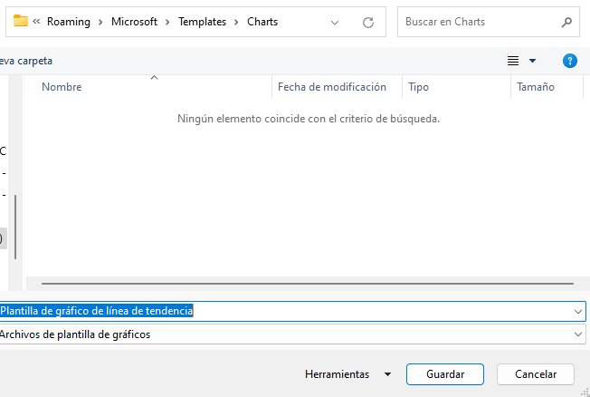

# Parte 1. Creando gráficos

## Objetivo de la práctica:
Al finalizar la práctica, serás capaz de:
- Crear gráficos básicos en Excel, seleccionando los tipos de gráficos más adecuados para representar diferentes conjuntos de datos.

- Utilizar herramientas avanzadas de gráficos en Excel, como la inserción de gráficos combinados y la personalización de gráficos recomendados para maximizar el impacto visual en presentaciones y análisis de datos.

## Duración aproximada:
- 7 minutos.

## Instrucciones 

### Escenario:
 Como analista de marketing para Develtech Industries, has recibido el libro de trabajo de Ventas Anuales del equipo de ventas. El gerente de ventas te ha pedido que construyas gráficos para los datos en el libro de trabajo que se usarán en la reunión anual de la empresa.

 
### Tarea 1. Abre el archivo llamado Annual Sales.xlxs.
[Annual Sales](<Annual Sales.xlsx>)

### Tarea 2. Crea un gráfico de columnas agrupadas a partir de los datos de ventas trimestrales.
Paso 1.  Verifica que la hoja de cálculo Quarterly Sales (Ventas Trimestrales) esté seleccionada y selecciona el rango A1:E5

Paso 2. Selecciona _Insertar → Gráficos Recomendados._

Paso 3. Explora los Gráficos Recomendados seleccionando las miniaturas de los gráficos.

Paso 4. Selecciona el primer gráfico recomendado, un gráfico de Columnas Agrupadas, y selecciona Aceptar.

Paso 5. Mueve el gráfico debajo de la tabla, si es necesario.

### Tarea 3. Crea un gráfico de líneas a partir de las ventas mensuales de laptops.

Paso 1. Selecciona la hoja de cálculo Sales Trends (Tendencias de Ventas) y selecciona el rango A1:A13

Paso 2.Mantén presionada la tecla Ctrl y selecciona *C1:C13*

Paso 3.Selecciona _Insertar → Insertar Gráfico de Líneas o Áreas y selecciona Línea, la primera variante de gráfico de líneas en 2-D._ 

### Tarea 4. Crea un gráfico circular a partir de los datos de comparación de ventas.

Paso 1. Selecciona la hoja de cálculo Sales Comparison (Comparación de Ventas) y selecciona el rango *A1:B5*

Paso 2.Selecciona el botón _Análisis Rápido_ y selecciona la pestaña Gráficos.

Paso 3.Pasa el cursor sobre los diferentes tipos de gráficos y selecciona el tipo de gráfico _Circular._

 

Paso 4. Guarda el libro de trabajo como _My Annual Sales.xlsx_ y mantén el archivo abierto.

### Resultado esperado
 
 
 

# Parte 2. Modificar y Formatear Gráficos 

## Objetivo de la práctica:
Al finalizar la práctica, serás capaz de:
- Modificar y formatear gráficos en Excel, aplicando cambios en los diseños, estilos y tipos de gráficos según las necesidades de presentación

- Ajustar y personalizar elementos específicos del gráfico, como títulos, etiquetas y tamaños de fuente, para mejorar la claridad y el impacto visual de tus datos.

- Trabajar con gráficos avanzados en Excel, incluyendo la modificación de gráficos de líneas, columnas y circulares 3D, así como la configuración de formatos de números y etiquetas.

## Duración aproximada:
- 8 minutos.

## Instrucciones 

### Antes de comenzar
Deberá tener abierto el archivo _Annual Sales_ 

### Escenario:
Como analista de marketing, has compartido tus gráficos iniciales con tu gerente. Tu gerente te ha sugerido que modifiques y formatees estos gráficos para una mejor presentación en la reunión anual de la empresa.

### Tarea 1. Cambia el diseño del gráfico de columnas agrupadas en la hoja de cálculo Quarterly Sales.

Paso 1. Selecciona la hoja de cálculo _Quarterly Sales_ y, si es necesario, selecciona el gráfico de columnas agrupadas.
 

Paso 2. Selecciona _Diseño de Gráfico → Diseño Rápido_ y selecciona Diseño 9 de la galería.

 

### Tarea 2. Cambia los títulos predeterminados en el gráfico de columnas.

Paso 1.  En la pestaña contextual _Formato_, desde la lista desplegable de Elementos del Gráfico, selecciona Título del Gráfico.

 

Paso 2. Selecciona la Barra de Fórmulas y escribe Quarterly Sales y presiona Enter.

 

Paso 3. Selecciona la etiqueta del Título del Eje Vertical (Valor) en el lado izquierdo del gráfico, escribe Sales y presiona Enter.

 

 Paso 4.  Selecciona la etiqueta del Título del Eje Horizontal (Categoría) en la parte inferior del gráfico, escribe 2021 y presiona Enter.

  

  
### Tarea 3. Mueve y cambia el tamaño del gráfico de columnas agrupadas de Quarterly Sales.

Paso 1.  haz clic y arrastra el gráfico de modo que la esquina superior izquierda del gráfico cubra la celda G3.
  

Paso 2. Señala el controlador de tamaño en la esquina inferior derecha hasta que el cursor cambie a un puntero de cambio de tamaño.Haz clic y arrastra para agrandar el gráfico hasta cubrir la celda P20.

  

### Tarea 4. Modifica el estilo del gráfico de líneas de Laptops en la hoja de cálculo Sales Trends.

Paso 1.  Selecciona la hoja de cálculo Sales Trends y, si es necesario, selecciona el gráfico de líneas.

Paso 2. En la pestaña contextual Diseño de Gráfico, en el grupo Estilos de Gráfico, selecciona el botón Más y en la galería selecciona el estilo 12.

   

   

### Tarea 5. Cambia las etiquetas del gráfico de líneas a un formato de moneda.

Paso 1. Selecciona el botón Elementos del Gráfico  y pasa el cursor sobre Etiquetas de Datos. Selecciona la flecha que aparece a la derecha y selecciona Más Opciones en el menú.

  

Paso 2.  En la sección Opciones de Etiqueta, desplázate hacia abajo y selecciona Número para expandir las opciones de formato.
  

Paso 3. En el menú Categoría, selecciona Moneda.
Paso 4. En Decimales, escribe 0.
Paso 5. Cierra el panel de tareas Formato de Etiquetas de Datos.

### Tarea 6. Cambia el tipo de gráfico del gráfico circular en la hoja de cálculo Sales Comparison a un gráfico circular 3D.

Paso 1. Selecciona la hoja de cálculo Sales Comparison y, si es necesario, selecciona el gráfico circular.

Paso 2.  Selecciona Diseño de Gráfico → Cambiar Tipo de Gráfico.

Paso 3. En la categoría Circular, selecciona la segunda variante, Circular 3D, y selecciona Aceptar.

### Tarea 7. Aplica un estilo de gráfico al gráfico circular

Paso 1. Selecciona el botón Estilos de Gráfico.
Paso 2. Selecciona Estilo 1.

Paso 3. Selecciona el botón Elementos del Gráfico y pasa el cursor sobre Etiquetas de Datos. Selecciona la flecha que aparece a la derecha y selecciona Más Opciones en el menú.

Paso 4. En el panel de tareas Formato de Etiquetas de Datos, en la sección Opciones de Etiqueta, marca la casilla Porcentaje y desmarca la casilla Valor.

Paso 5. Cierra el panel de tareas Formato de Etiquetas de Datos. 

Paso 6. En la pestaña Inicio, en la lista desplegable Tamaño de Fuente, selecciona 14.

Paso 7. Guarda los cambios y manten abierto el documento.

### Resultado esperado

# Parte 3. Crear un gráfico de doble eje con una línea de tendencia

## Objetivo de la práctica:
Al finalizar la práctica, serás capaz de:
- Crear gráficos de doble eje: Aprenderás a crear un gráfico combinado que muestre dos conjuntos de datos en un solo gráfico utilizando dos ejes Y diferentes.

- Añadir y personalizar líneas de tendencia: Descubrirás cómo agregar una línea de tendencia a un gráfico para pronosticar datos futuros.

- Modificar y personalizar gráficos: Serás capaz de ajustar títulos de ejes, mover gráficos dentro de la hoja de trabajo, y realizar otros cambios de formato en los gráficos.

## Duración aproximada:
- 8 minutos.

## Instrucciones 

### Escenario
Además de los gráficos anteriores que has creado, tu gerente te ha pedido que construyas algunos gráficos más complejos. Te han proporcionado una hoja de trabajo que contiene los totales mensuales del segundo y tercer trimestre y su porcentaje de ventas totales del año hasta ahora. Tu gerente ha oído hablar de los gráficos combinados y quiere que muestres las ventas totales en un eje y el porcentaje de ventas totales en otro. Además, con solo seis meses de datos registrados, a tu gerente le gustaría ver una proyección de lo que podrían ser los próximos tres meses. Decides añadir una línea de tendencia para pronosticar esta tendencia.
### Tarea 1. Crear un gráfico combinado a partir de los totales mensuales.
Paso 1. Selecciona la hoja de trabajo _Monthly Totals._

Paso 2. Selecciona el rango _A1:C7_

Paso 3.  Selecciona _Insertar → Gráficos recomendados._

Paso 4. En el cuadro de diálogo Insertar gráfico, selecciona la pestaña Todos los gráficos y selecciona _Combinado_

Paso 5. En la sección Elige el tipo de gráfico y el eje para tu serie de datos, en la fila de % de ventas totales, marca la casilla para Eje secundario.

Paso 6. Mueve el gráfico debajo del rango, según sea necesario.

### Tarea 2. Modifica el título del gráfico e incluye títulos de eje para cada eje Y.
Paso 1. Selecciona el botón _Elementos del gráfico_ y pasa el cursor sobre _Títulos de ejes_. Selecciona la flecha que aparece a la derecha y selecciona _Vertical principal_ y _Vertical secundario._

Paso 2. En el lado izquierdo del gráfico, selecciona el Título del eje vertical (valor). Escribe = y selecciona la celda B1, luego presiona Enter.

Paso 3. En el lado derecho del gráfico, selecciona el Título del eje vertical secundario (valor). Escribe = y selecciona la celda C1, luego presiona Enter.

Paso 4. Selecciona _elementos_del_gráfico_, la opción titulo de gráfico, escribe  _Monthly Totals_

### Tarea 3. Añadir una línea de tendencia a la serie de ventas totales.

Paso 1. En la pestaña contextual Formato, en la lista desplegable de Elementos del gráfico, selecciona Serie _"Total Sales" (Ventas Totales)._

Paso 2. Selecciona el botón Elementos del gráfico y pasa el cursor sobre Línea de tendencia. Selecciona la flecha que aparece a la derecha y selecciona Más opciones.

Paso 3. En el panel de tareas Formato de línea de tendencia, verifica que la pestaña de nivel superior Opciones de línea de tendencia esté seleccionada.

Paso 4. En la sección Opciones de línea de tendencia, verifica que _Lineal_ esté seleccionado. En el grupo _Extrapolar_, selecciona el cuadro de texto _En el futuro_ y escribe 3, luego presiona Enter.

Paso 5.  Verifica que la línea de tendencia se haya añadido al gráfico, pronosticando tres períodos hacia adelante.

Paso 6. Cierra el panel de tareas Formato de línea de tendencia.

Paso 7. Guarda los cambios realizados y manten abierto el libro. 
### Resultado esperado

# Parte 4. Creación de una Plantilla de Gráfico

## Objetivo de la práctica:
Al finalizar la práctica, serás capaz de:
- Guardar gráficos personalizados como plantillas: Aprenderás a convertir un gráfico existente en una plantilla, permitiendo su reutilización para futuros conjuntos de datos o proyectos.

- Utilizar una plantilla de gráfico guardada para crear gráficos consistentes y profesionales con nuevos datos.

- Podrás comprobar que la plantilla de gráfico se ha aplicado correctamente, generando un gráfico combinado de doble eje con una línea de tendencia.

## Duración aproximada:
- 5 minutos.

## Instrucciones 
### Escenario
Te gusta la apariencia del gráfico que creaste para pronosticar las ventas mensuales y sabes que crearás gráficos similares para otros períodos de ventas. En lugar de crear y añadir manualmente elementos a tus gráficos cada vez, decides crear una plantilla de gráfico a partir del gráfico que puedes aplicar a futuros conjuntos de datos. Decides probarla con algunos datos del año anterior, solo para asegurarte de que la plantilla funcione.

### Nota 
Verifica que estás en la hoja de trabajo Monthly Totals, y si es necesario, selecciona el gráfico combinado Monthly Totals.

### Tarea 1. Guarda el gráfico como una plantilla:
Paso 1. Haz clic derecho en el gráfico y selecciona Guardar como plantilla.

Paso 2. En el cuadro de diálogo Guardar plantilla de gráfico, asegúrate de que la carpeta Charts esté seleccionada

### Nota: 
Excel debería dirigirte automáticamente a la carpeta Charts. El nombre de usuario que aparece en la ruta de las plantillas de gráficos será tu nombre de usuario. La carpeta AppData es normalmente una carpeta del sistema oculta, por lo que no la verás al explorar con el Explorador de archivos. Sin embargo, puedes escribir AppData en la barra de direcciones para ir directamente a esa carpeta

### Tarea 2.Guarda el gráfico como una plantilla:
Paso 1. En el campo Nombre del archivo, escribe: _Plantilla de gráfico de línea de tendencia._

Paso 2. En el campo Nombre del archivo, escribe Plantilla de gráfico de línea de tendencia.

### Tarea 3. Prueba la nueva plantilla de gráfico:

Paso 1.  Selecciona la hoja de trabajo _2021 Sales._

Paso 2. Selecciona el rango *A1:C7*

Paso 3. Selecciona _Insertar -> Graficos recomendados

Paso 4. Selecciona _Todos los gráficos_ y selecciona _Plantillas_

Paso 5. Selecciona la plantilla que guardaste y da clic en aceptar 

Paso 6. Verifica que Excel haya creado un gráfico combinado de doble eje con una línea de tendencia.

### Resultado esperado

