# Parte 1. Crear una Tabla Dinámica

## Objetivo de la práctica:

Al finalizar la práctica, serás capaz de:

- Crear y modificar tablas dinámicas en Excel, incluyendo la personalización de los informes para mostrar datos específicos como ventas totales por productos y regiones.

## Duración aproximada:
- 5 minutos.

## Instrucciones: 

### Escenario:

Como gerente de ventas, necesitas realizar un seguimiento de las ventas. Debido a que los productos de Develetech se venden en muchas regiones, deseas poder analizar los datos de ventas de varias maneras. Decides que la mejor manera de responder a tus preguntas ahora y en el futuro es crear una tabla dinámica.

### Abre el siguiente archivo:

[Sales Data](<Sales Data.xlsx>)

### Tarea 1. Crea una tabla dinámica a partir de los datos.

Paso 1. Asegúrate de que la celda A1 esté seleccionada.

Paso 2.  Selecciona _Insertar → Tabla Dinámica_.

Paso 3. En la sección Elige los datos que deseas analizar, verifica que la opción Seleccionar una tabla o rango esté seleccionada.

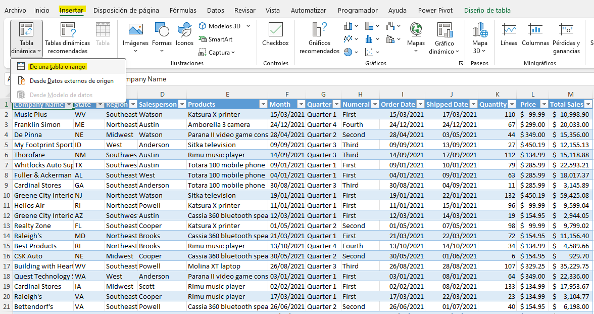

Paso 4. En la sección Elige dónde deseas colocar el informe de la tabla dinámica, verifica que la opción _Nueva hoja_ de trabajo esté seleccionada y selecciona Aceptar.

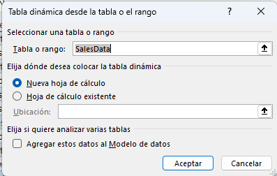

Paso 5. Observa que el marco de la tabla dinámica se crea en una nueva hoja de trabajo.

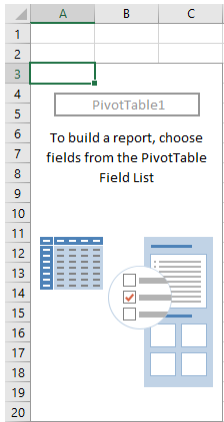

### Tarea 2. Construye el informe de la tabla dinámica.

Paso 1. En el panel de tareas de Campos de tabla dinámica, en la sección Elegir campos para agregar al informe, marca las casillas de verificación para _Región_ y _Ventas totales_.

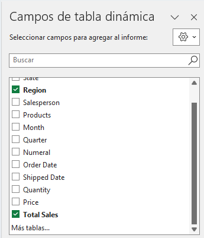

Verifica que Excel construya una tabla dinámica en Hoja1 que muestre la suma de las ventas totales para cada región.

Nota: Observa que Excel no conserva el formato de celda de los datos originales al crear informes de tabla dinámica.

### Tarea 3. Crear una tabla dinámica recomendada a partir de los datos de ventas.

Paso 1.  Selecciona la hoja de trabajo Datos y verifica que la celda A1 esté seleccionada.

Paso 2.  Selecciona _Insertar → Tablas Dinámicas Recomendadas_.

Paso 3. Examina las diversas opciones de tabla dinámica en el cuadro de diálogo _Tablas Dinámicas Recomendadas_. Selecciona la segunda variante, Suma de Ventas Totales por Región, y selecciona Aceptar.

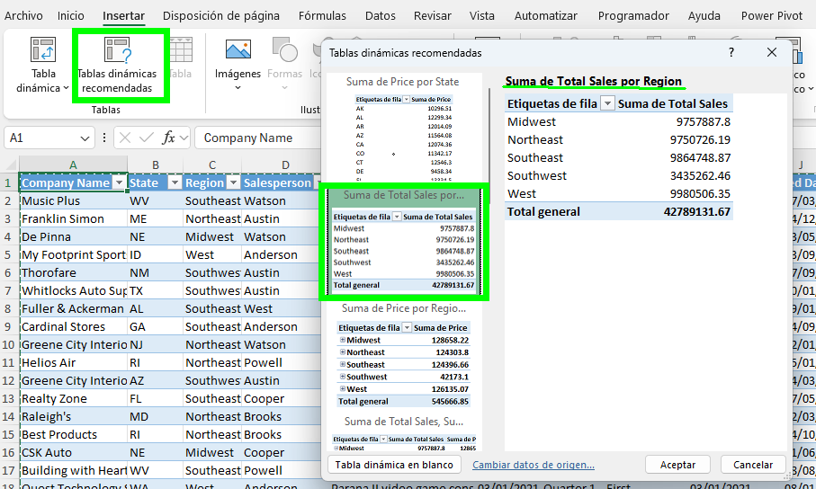

Paso 4.  Verifica que *Hoja2* contenga la nueva tabla dinámica.

Nota: Esta acción construye el mismo informe de tabla dinámica en Hoja2 que el primer informe de tabla dinámica en Hoja1. Las tablas dinámicas recomendadas son una buena manera de comenzar a construir tus propios informes de tabla dinámica.

### Tarea 4. Modifica la tabla dinámica en Hoja2 para incluir productos.

Paso 1. En el panel de tareas _Campos de Tabla Dinámica_, en la sección _Elegir campos_ para agregar al informe, selecciona _Productos_.

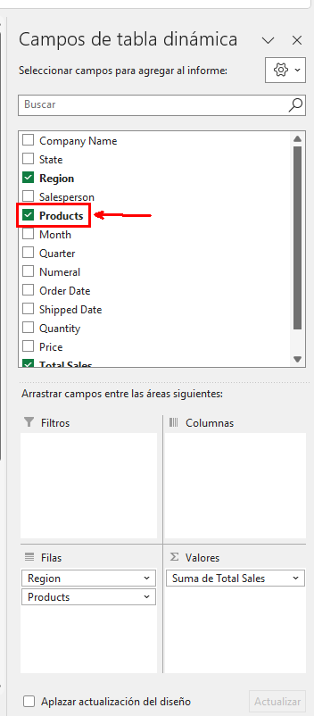

Verifica que la tabla dinámica se actualiza para incluir las ventas totales de productos en cada región.

Paso 2. Guarda los cambios realizados en el archivo y mantenlo abierto.

### Resultado esperado:

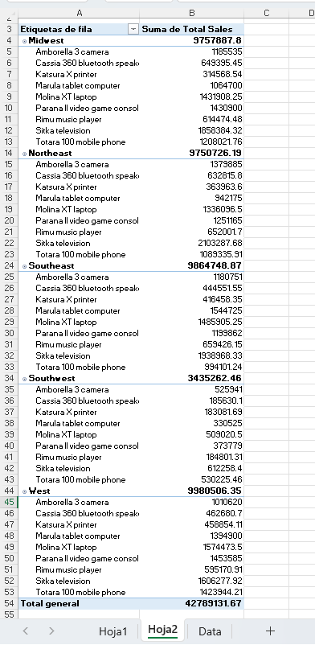

# Parte 2. Analizando los datos de la tabla dinámica. 

## Objetivo de la práctica:

- Modificar informes de tablas dinámicas para extraer y analizar datos específicos, como ventas por trimestre y región.

- Aplicar filtros y personalizar la visualización de datos en tablas dinámicas.

- Formatear datos en una tabla dinámica utilizando opciones de configuración de campos de valor.

- Ordenar datos en una tabla dinámica para identificar tendencias y patrones de ventas.

## Duración aproximada:

-  7 minutos.

## Instrucciones: 

### Antes de comenzar:

El libro de trabajo My Sales Data.xlsx está abierto.

### Escenario:

Estás satisfecho con los informes de la tabla dinámica que has creado. Ahora deseas ver qué otra información puedes extraer de la tabla dinámica. Decides ver si puedes responder las siguientes preguntas:

- ¿Cuáles son las ventas del cuarto trimestre?
- ¿Cuáles son las ventas totales para cada trimestre por región?
- ¿Cuáles son las ventas totales para cada región por producto?

### Tarea 1. Modifica el informe de la tabla dinámica en Sheet1 para responder a la pregunta: "¿Cuáles son los valores de ventas del cuarto trimestre?".

Paso 1. Selecciona Hoja 1 y verifica que la tabla dinámica esté seleccionada.

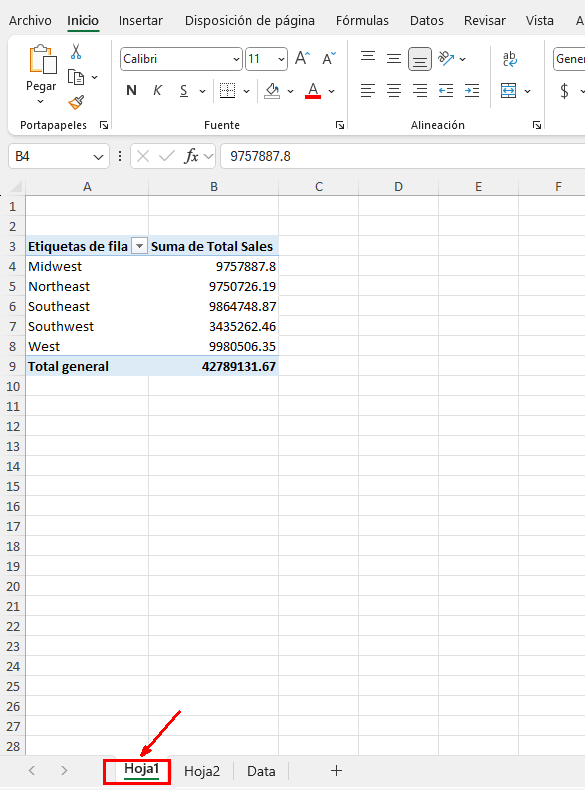

Paso 2. En el panel de tareas Campos de la tabla dinámica, en la opción Mostrar, selecciona _Lista de campos_, arrastra y suelta el campo _Trimestre_ _(Quarter)_ en el área de Filtros. Verifica que Trimestre esté en la celda *A1* y que hay un filtro en la celda *B1*.

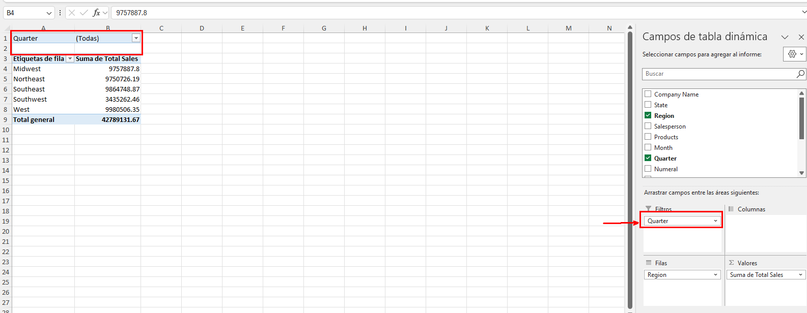

Paso 3. Selecciona la flecha desplegable en la celda B1, selecciona Cuarto Trimestre y luego selecciona OK.
Verifica que las ventas totales del cuarto trimestre son _10025418_.

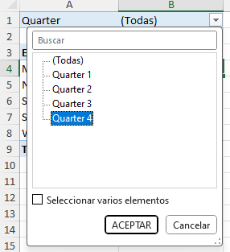

### Tarea 2. Elimina el filtro de Trimestre y modifica el informe de la tabla dinámica para responder a la pregunta: "¿Cuáles son las ventas totales por región para cada trimestre?".

Paso 1. Selecciona la flecha desplegable de _AutoFiltro_ en la celda *B1*, selecciona Seleccionar _todo_ y luego selecciona OK.

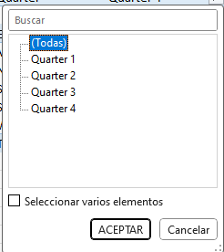

Paso 2.  En el panel de tareas Campos de la tabla dinámica, en la sección Arrastrar campos entre las áreas, a continuación, arrastra y suelta Trimestre desde el área de Filtros al área de Columnas.
Verifica que el informe de la tabla dinámica se actualiza para mostrarte las ventas totales para cada región por trimestre.

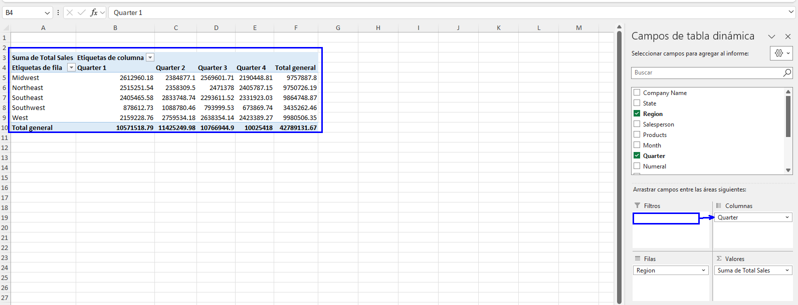

### Tarea 3. Modifica la tabla dinámica en Hoja 2 para responder a la pregunta: "¿Cuáles son las ventas totales para cada región por producto?".

Paso 1. Selecciona _Hoja 2_ y verifica que la Tabla dinámica está seleccionada.

Paso 2. En el panel de tareas Campos de la tabla dinámica, en la sección Arrastrar campos entre las áreas, a continuación, arrastra y suelta _Productos_ desde el área de Filas al área de _Columnas._
Verifica que el informe de la tabla dinámica se actualiza para mostrarte las ventas regionales para cada producto.

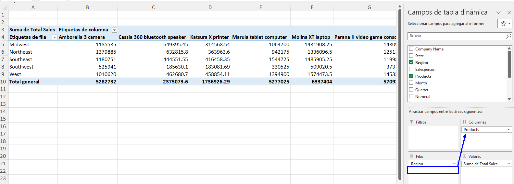

### Tarea 4. Modifica el formato del informe de la tabla dinámica.

Paso 1.  En el panel de tareas Campos de la tabla dinámica, en la sección Arrastrar campos entre las áreas, a continuación, en el área _Valores_, selecciona la flecha desplegable de _Suma de ventas totales_ y selecciona Configuración de campo de valor.

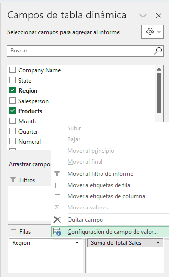

Paso 2.  En el cuadro de diálogo Configuración de campo de valor, selecciona el botón _Formato de número_.

Paso 3.  En el cuadro de diálogo Formato de celdas, en la lista de categorías, selecciona Moneda.

Paso 4. En el cuadro de Posiciones decimales, escribe 0 y luego selecciona OK.

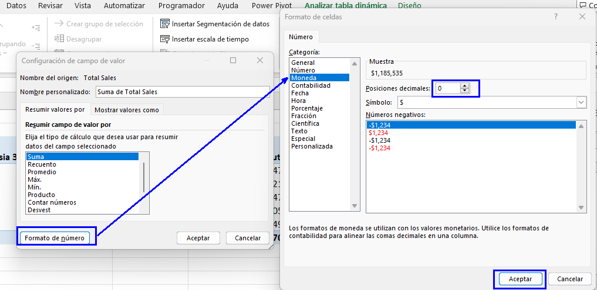

Paso 5. En el cuadro de diálogo Configuración de campo de valor, selecciona OK para guardar la configuración del campo de valor.

Verifica que la tabla dinámica ha actualizado los valores totales de ventas con el formato de moneda.

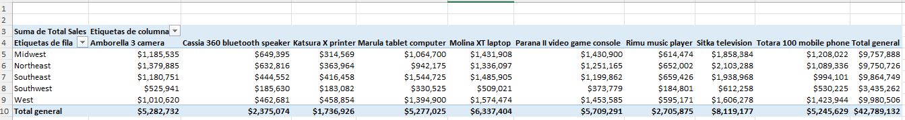

### Tarea 5. Ordena los valores de Total general de menor a mayor.

Paso 1. Selecciona uno de los valores de Total general en la columna K.

Paso 2.  Selecciona _Inicio → Ordenar y filtrar → Ordenar de menor a mayor._
Verifica que los totales generales estén ordenados de menor a mayor.

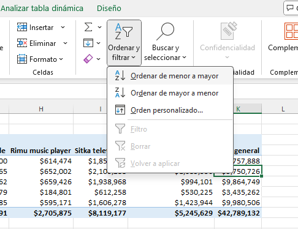

Paso 3. Guarda el libro de trabajo y mantén el archivo abierto.

### Resultado esperado:

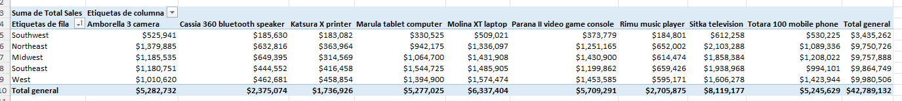

# Parte 3.Presentación de datos con gráficos dinámicos (PivotCharts).

## Objetivo de la práctica:

- Crear gráficos dinámicos (PivotCharts) a partir de tablas dinámicas (PivotTables) para representar visualmente datos complejos.

- Personalizar y modificar el diseño de gráficos dinámicos para mejorar la visualización de datos.

- Aplicar y ajustar filtros en gráficos dinámicos y tablas dinámicas para analizar datos específicos, como ventas por región o producto.

- Examinar en detalle las ventas por región utilizando la función de mostrar detalles en gráficos dinámicos.

- Interpretar y analizar las variaciones de ventas a través de gráficos dinámicos para apoyar la toma de decisiones informadas.

## Duración aproximada:

- 7 minutos.

## Instrucciones: 

### Antes de comenzar:

El libro de trabajo My Sales Data.xlsx está abierto.

### Escenario:

Estás satisfecho con las modificaciones que has hecho en los informes de tablas dinámicas que has creado. Sabes que cuando presentes estos datos a la dirección, querrán ver los datos representados visualmente. Decides crear un gráfico dinámico (PivotChart) a partir de uno de tus informes de tablas dinámicas.

### Tarea 1. Crear un gráfico dinámico (PivotChart) a partir de la tabla dinámica en _Hoja 1_.

Paso 1. Selecciona _Hoja1_ y verifica que la tabla dinámica esté seleccionada.

Paso 2. En la pestaña contextual Analizar tabla dinámica, selecciona _Gráfico dinámico (PivotChart)_.

Paso 3. En el cuadro de diálogo _Insertar gráfico_, verifica que la categoría Gráfico de columnas esté seleccionada, selecciona el cuarto sub-tipo, Columna agrupada en 3D (3-D Clustered Column), y selecciona OK.

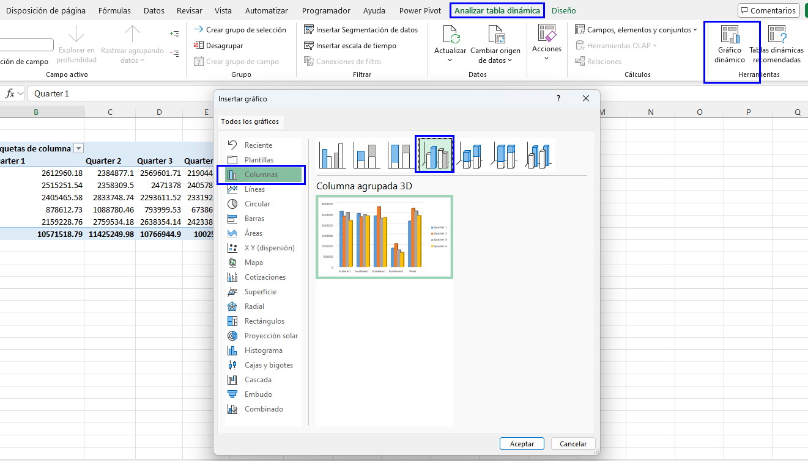

### Tarea 2. Examina la región suroeste (southwest), ya que puedes ver que las ventas totales en esta región son más bajas que en otras regiones.

Paso 1. En el Gráfico dinámico (PivotChart), selecciona la flecha desplegable del botón de campo _Región_ y desmarca Seleccionar todo. Luego, selecciona Suroeste (Southwest) y selecciona OK.

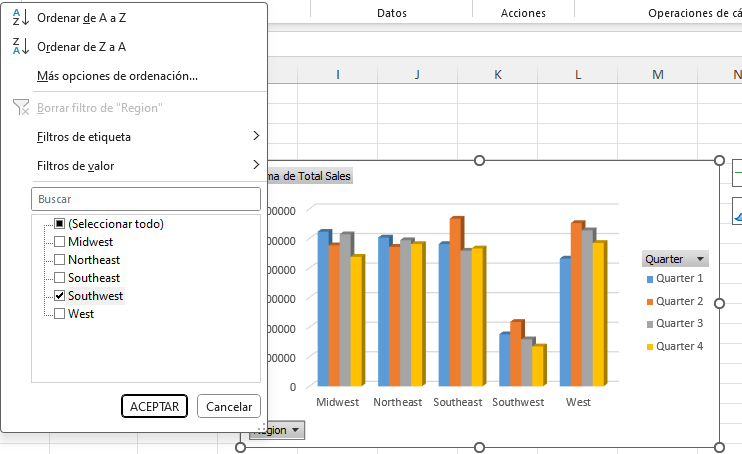

Paso 2. Observas que hay una disminución en las ventas después del segundo trimestre en la región suroeste.

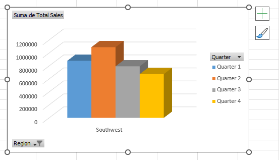

### Nota:

Cuando se aplica un filtro a un Gráfico dinámico (PivotChart), el mismo filtro se aplica a la Tabla dinámica (PivotTable).

### Tarea 3. Crear un gráfico dinámico (PivotChart) para la tabla dinámica en _Hoja2_.

Paso 1. Selecciona _Hoja2_ y verifica que la tabla dinámica esté seleccionada.

Paso 2.  En la pestaña contextual Analizar tabla dinámica, selecciona Gráfico dinámico (PivotChart).

Paso 3. En el cuadro de diálogo Insertar gráfico, verifica que la categoría Gráfico de columnas esté seleccionada, selecciona el cuarto sub-tipo, Columna agrupada en 3D (3-D Clustered Column), y selecciona OK.

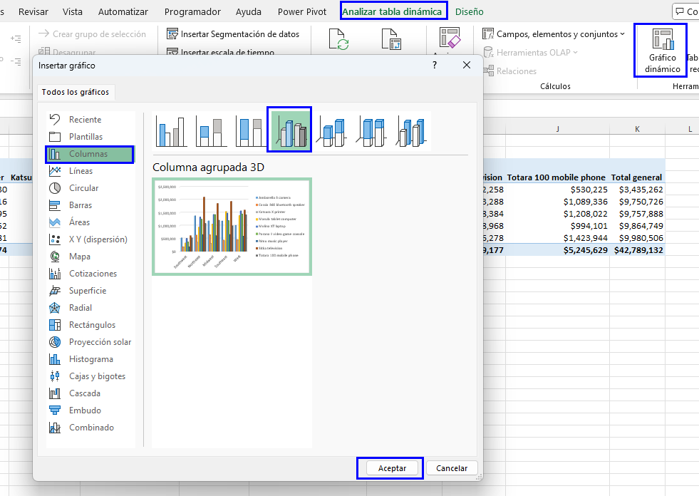

Paso 4. Mueve el gráfico dinámico (PivotChart) debajo de la tabla dinámica, según sea necesario.

### Tarea 4. Examina las ventas de productos para la región suroeste.

Paso 1. En la celda *A4* de la tabla dinámica, selecciona la flecha desplegable de _AutoFiltro_ de etiquetas de fila (Row Labels AutoFilter) y desmarca Seleccionar todo (Select All). Luego, selecciona Suroeste (Southwest) y selecciona OK.

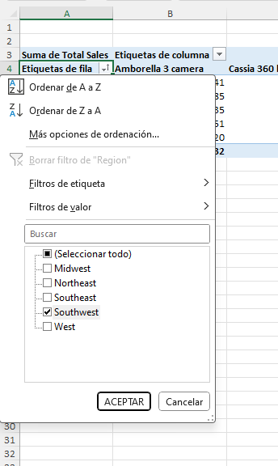

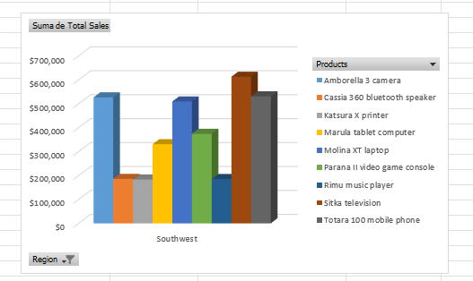

### Tarea 5. Modifica el diseño del gráfico dinámico (PivotChart) en Sheet1 para explorar más detalles de la región suroeste.

Paso 1. Selecciona _Hoja1_ y selecciona el gráfico dinámico (PivotChart), si es necesario.

Paso 2. En la pestaña contextual Diseño (Design), selecciona Estilo 8 (Style 8).

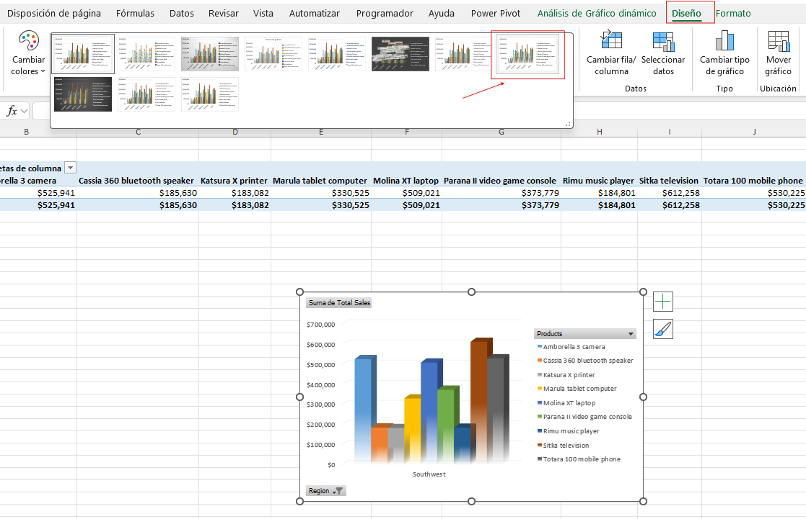

####  Nota:

Es posible que tengas que seleccionar el botón Más (More) en la galería de estilos de gráficos (Chart Styles).

Paso 3.  Haz doble clic en cualquier columna del gráfico dinámico (PivotChart).

Paso 4. En el cuadro de diálogo Mostrar detalles (Show Details), selecciona Estado (State) y selecciona OK.

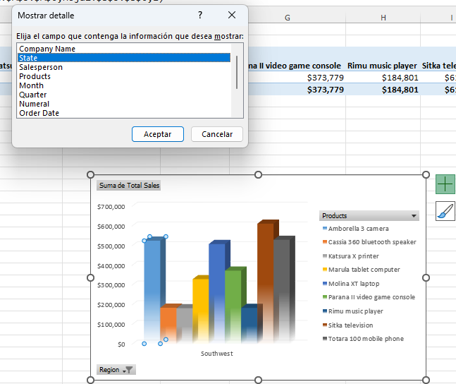

Paso 5. Observa que el gráfico dinámico (PivotChart) y la tabla dinámica (PivotTable) se actualizan con los estados en la región suroeste.

Paso 6. Guarda los cambios realizados y mantén el libro abierto.

### Resultado esperado:

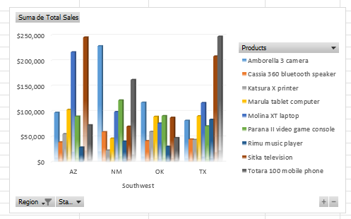

# Parte 4. Filtrar datos utilizando segmentaciones (Slicers) y líneas de tiempo (Timelines).

## Objetivo de la práctica:

Al finalizar la práctica, serás capaz de:

- Utilizar líneas de tiempo (Timelines) en tablas dinámicas y gráficos dinámicos para filtrar y visualizar datos específicos, como las ventas del cuarto trimestre en una región determinada.

- Insertar y personalizar segmentaciones (Slicers) para filtrar tablas dinámicas y gráficos dinámicos, permitiendo un análisis más detallado de los datos.

- Aplicar filtros combinados utilizando segmentaciones múltiples para analizar ventas en diferentes estados y por diferentes vendedores.

- Interpretar los resultados filtrados para identificar tendencias y patrones, como la distribución de ventas en regiones específicas y el rendimiento de vendedores particulares.

## Duración aproximada:

- 8 minutos.

## Instrucciones: 

### Antes de comenzar:

El libro de trabajo My Sales Data.xlsx está abierto. 

### Escenario:

Estás satisfecho con las modificaciones que has hecho en los informes de tablas dinámicas y los nuevos gráficos dinámicos que has creado. Te das cuenta de que las preguntas iniciales que formulaste para analizar tus datos eran desde tu propia perspectiva. Para hacer que las tablas dinámicas y los gráficos dinámicos sean más flexibles, decides crear una línea de tiempo e insertar segmentaciones. Esto te permitirá a ti y a cualquier otra persona ver los datos de ventas de muchas maneras.

### Tarea 1. Inserta una línea de tiempo para ver los valores de ventas del cuarto trimestre para la región suroeste.

Paso 1. Selecciona la hoja de trabajo _Hoja2_ y mueve el gráfico dinámico para ver claramente la tabla dinámica, si es necesario. Da doble clic a una barra del gráfico y en los campos de la tabla dinámica desmarca _State_.

Paso 2. Selecciona la Tabla dinámica (PivotTable) y, en la pestaña contextual _Analizar tabla dinámica_, selecciona _Insertar escala de tiempo_.

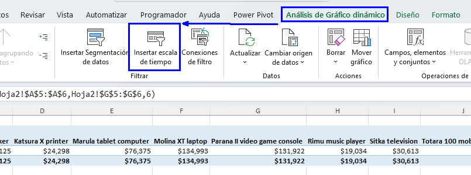

Paso 3. En el cuadro de diálogo Insertar líneas de tiempo (Insert Timelines), selecciona Fecha de pedido (Order Date) y selecciona OK.

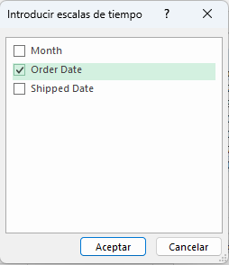

Paso 4. Mueve la línea de tiempo para ver claramente todos los objetos de la hoja de trabajo, si es necesario.

Paso 5. Selecciona la flecha desplegable del Nivel de tiempo (Time Level) y selecciona TRIMESTRES (QUARTERS).

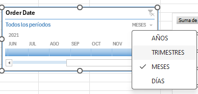

Paso 6.  Selecciona Q4 de 2021 y verifica que tanto la tabla dinámica como el gráfico dinámico se actualicen para mostrar solo los valores del cuarto trimestre.

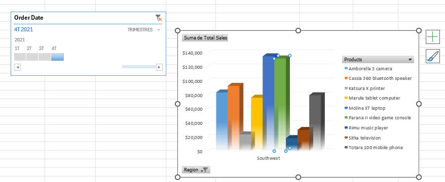

### Tarea 2. Inserta segmentaciones (slicers) para filtrar la tabla dinámica (PivotTable) y el gráfico dinámico (PivotChart).

Paso 1. Selecciona la Tabla dinámica (PivotTable), si es necesario, y en la pestaña contextual Analizar tabla dinámica (PivotTable Analyze), selecciona Insertar segmentación (Insert Slicer).

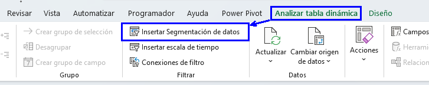

Paso 2. En el cuadro de diálogo Insertar segmentación (Insert Slicer), marca Estado (State) y Vendedor (Salesperson), y luego selecciona OK.

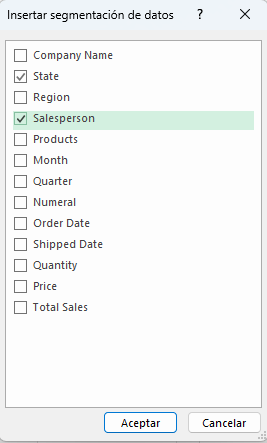

Paso 3. Mueve las segmentaciones de Vendedor (Salesperson) y Estado (State) según sea necesario para ver claramente todos los objetos de la hoja de trabajo.

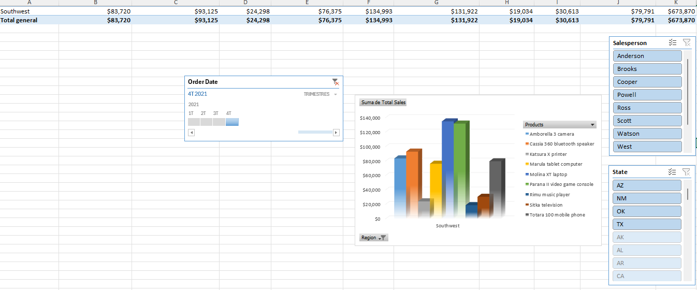

### Tarea 3. Usando las segmentaciones, filtra las ventas en Nuevo México y Texas para el vendedor Anderson.

Paso 1. En la segmentación de Estado (State), selecciona Selección múltiple (Multi-Select).

Paso 2. Selecciona AZ y OK para desactivar esos estados.

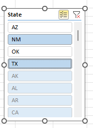

Paso 3. En la segmentación de Vendedor (Salesperson), selecciona Anderson.

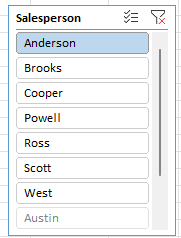

Verifica que la tabla dinámica (PivotTable) y el gráfico dinámico (PivotChart) se actualicen para mostrar las ventas totales de Anderson en Texas (TX) en el cuarto trimestre (Q4), observando que Anderson no tiene ventas en Nuevo México (NM).

### Resultado esperado:
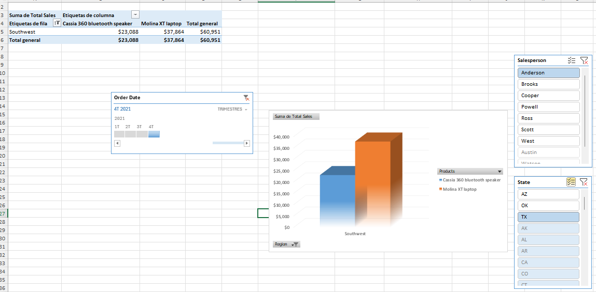
